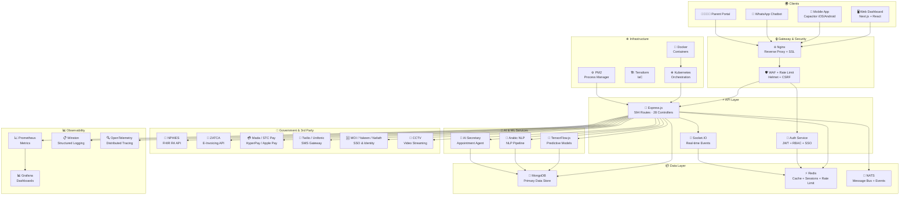

<p align="center">
  <!--  -->
  <!-- ☝️ استبدل بشعار الأوائل الرسمي. يُفضل صورة PNG بخلفية شفافة، 180×180 بكسل. -->
  
</p>

<h1 align="center">
  🏥 Al-Awael ERP — الأوائل إي آر بي
</h1>

<p align="center">
  <strong>نظام إدارة موارد المؤسسات لمراكز الأوائل للتأهيل والرعاية النهارية</strong><br/>
  <em>Enterprise Resource Planning for Al-Awael Rehabilitation & Day Care Centers</em>
</p>

<p align="center">
  <!-- Badges -->
  <a href="https://github.com/alawael/alawael-erp/releases">
    
  </a>
  <a href="#">
    
  </a>
  <a href="LICENSE">
    
  </a>
  <a href="#">
    
  </a>
  <a href="#">
    
  </a>
  <a href="#">
    
  </a>
  <a href="#">
    
  </a>
  <a href="#">
    
  </a>
  <a href="#">
    
  </a>
  <a href="#">
    
  </a>
</p>

<p align="center">
  <a href="#-المحتويات">🇬🇧 English</a> · <a href="#-table-of-contents">🇬🇧 English</a> · <a href="#-changelog">التغييرات</a> · <a href="#-license">الترخيص</a>
</p>

---

## 📑 المحتويات / Table of Contents

- [🎯 الملخص / Overview](#-الملخص--overview)
- [✨ المميزات الرئيسية / Key Features](#-المميزات-الرئيسية--key-features)
- [🏗️ البنية التقنية / Architecture](#-البنية-التقنية--architecture)
- [📊 التقارير والتحليلات / Reports & Analytics](#-التقارير-والتحليلات--reports--analytics)
- [🚀 البدء السريع / Quick Start](#-البدء-السريع--quick-start)
- [📸 لقطات الشاشة / Screenshots](#-لقطات-الشاشة--screenshots)
- [🌐 توثيق واجهة البرمجة / API Documentation](#-توثيق-واجهة-البرمجة--api-documentation)
- [🛡️ الأمان والامتثال / Security & Compliance](#-الأمان-والامتثال--security--compliance)
- [🔌 التكاملات الحكومية / Government Integrations](#-التكاملات-الحكومية--government-integrations)
- [🤖 الذكاء الاصطناعي / AI & Machine Learning](#-الذكاء-الاصطناعي--ai--machine-learning)
- [📱 التطبيقات / Applications](#-التطبيقات--applications)
- [📁 هيكل المشروع / Project Structure](#-هيكل-المشروع--project-structure)
- [🧪 الاختبارات / Testing](#-الاختبارات--testing)
- [🛠️ نشر وإدارة العمليات / Deployment & Ops](#-نشر-وإدارة-العمليات--deployment--ops)
- [📦 التبعيات / Dependencies](#-التبعيات--dependencies)
- [👥 المساهمة / Contributing](#-المساهمة--contributing)
- [📝 الترخيص / License](#-الترخيص--license)
- [📞 التواصل / Contact](#-التواصل--contact)
- [📜 سجل التغييرات / Changelog](#-سجل-التغييرات--changelog)

---

## 🎯 الملخص / Overview

<p dir="rtl">
<strong>نظام الأوائل إي آر بي (Al-Awael ERP)</strong> هو حل متكامل لإدارة موارد المؤسسات (ERP) من المستوى المؤسسي، مبني خصيصًا لـ <strong>مراكز الأوائل للتأهيل والرعاية النهارية</strong> في المملكة العربية السعودية. يغطي النظام كامل دورة حياة المريض — من الاستقبال والتقييم الأولي إلى وضع خطط الرعاية الفردية والمتابعة الدورية والتقارير التحليلية — مع الامتثال الكامل للوائح وزارة الصحة السعودية ومعايير التأمين الوطني (NPHIES) ونظام الفاتورة الإلكترونية (ZATCA).
</p>

**Al-Awael ERP** is an enterprise-grade, rehabilitation-center management system purpose-built for **Al-Awael Rehabilitation & Day Care Centers** in the Kingdom of Saudi Arabia. It covers the full patient lifecycle — from intake and initial assessment through individualized care planning, periodic follow-up, and analytical reporting — with full compliance to Saudi Ministry of Health regulations, the National Health Insurance (NPHIES) standards, and ZATCA e-invoicing.

| الجانب / Aspect | التفاصيل / Details |
| :--- | :--- |
| **الصناعة / Industry** | مراكز التأهيل والرعاية النهارية / Rehabilitation & Day Care Centers |
| **الموقع الجغرافي / Market** | المملكة العربية السعودية / Kingdom of Saudi Arabia 🇸🇦 |
| **نموذج الترخيص / License** | MIT (Open Source) |
| **الحجم / Scale** | ~594 route · 28 controller · 593 model · 208 service · 14 bounded context |
| **الإصدار الحالي / Current Version** | `v3.5.0` |
| **حالة الإنتاج / Production Status** | ✅ نشط وقيد التشغيل / Active & Live |

---

## ✨ المميزات الرئيسية / Key Features

<details>
<summary dir="rtl">🏥 السجل الطبي الإلكتروني (EMR) / Electronic Medical Records</summary>

- **التقييمات القياسية / Standardized Assessments:** دعم كامل لتقييمات ICF (التصنيف الدولي للأداء والإعاقة) و CARS و PEP-3 و ABLLS وغيرها.
- **خطط الرعاية الفردية / Individual Care Plans:** خطط علاجية مخصصة مع أهداف قابلة للقياس (SMART Goals) وجدول زمني للمتابعة.
- **اجتماعات الفريق متعدد التخصصات / MDT Meetings:** إدارة جلسات الفريق العلاجي متعدد التخصصات (طب، علاج طبيعي، علاج وظيفي، نطق، نفسي، اجتماعي).
- **الملف الطبي الشامل / Comprehensive Patient File:** تاريخ طبي كامل شامل التشخيصات، الأدوية، التحاليل، والتقارير الطبية.
- **Telehealth / التطبيب عن بُعد:** جلسات علاجية افتراضية مع تقييم عن بُعد وتقارير جلسات الفيديو.

</details>

<details>
<summary dir="rtl">👨‍👩‍👧‍👦 بوابة أولياء الأمور / Parent Portal</summary>

- **لوحة متابعة الطفل / Child Dashboard:** تتبع الوقت الفعلي لتقدم الطفل في الجلسات والعلاج.
- **التقارير الدورية / Periodic Reports:** تقارير أسبوعية وشهرية عن الأداء والإنجازات.
- **التواصل المباشر / Direct Communication:** مراسلة مباشرة مع الفريق العلاجي عبر التطبيق.
- **حجز المواعيد / Appointment Booking:** حجز وإدارة المواعيد عبر الإنترنت.
- **الإشعارات / Notifications:** إشعارات فورية للجلسات والتقارير والأحداث الهامة.

</details>

<details>
<summary dir="rtl">💰 المالية والفواتير / Finance & Billing</summary>

- **الفاتورة الإلكترونية / E-Invoicing:** تكامل كامل مع هيئة الزكاة والضريبة (ZATCA) — الفاتورة الإلكترونية Phase 1 & Phase 2.
- **بوابات الدفع / Payment Gateways:** دعم مدى (Mada) و STC Pay و HyperPay و Apple Pay.
- **التأمين الصحي / Insurance:** تكامل مع النظام الوطني للتأمين الصحي (NPHIES) عبر FHIR R4.
- **إدارة المطالبات / Claims Management:** إدارة دورية لمطالبات التأمين والمتابعة مع الجهات التأمينية.
- **التقارير المالية / Financial Reports:** تقارير الإيرادات والمصروفات والأرباح والخسائر والموازنات.

</details>

<details>
<summary dir="rtl">👥 الموارد البشرية / Human Resources</summary>

- **إدارة التراخيص الطبية / License Management:** تتبع تراخيص SCFHS (الهيئة السعودية للتخصصات الصحية) و ساعات CPE (التعليم المستمر).
- **GOSI Integration:** تكامل مع المؤسسة العامة للتأمينات الاجتماعية.
- **الحضور والانصراف / Attendance:** نظام حضور متكامل مع التقارير الدورية.
- **إدارة الرواتب / Payroll:** حلول حساب الرواتب والبدلات والعمولات.
- **التقييم الوظيفي / Performance Reviews:** دورات تقييم أداء دورية للموظفين.

</details>

<details>
<summary dir="rtl">📊 التحليلات التجارية (BI) / Business Intelligence</summary>

- **لوحات تحكم تفاعلية / Interactive Dashboards:** Grafana + Prometheus لمراقبة الأداء في الوقت الفعلي.
- **التنبؤ بالطلب / Demand Forecasting:** نماذج تنبؤية باستخدام TensorFlow.js لتوقع أعداد المرضى والموارد المطلوبة.
- **تحليل الاتجاهات / Trend Analysis:** تحليل الاتجاهات العلاجية والمالية والتشغيلية.
- **التقارير المخصصة / Custom Reports:** منشئ تقارير مرن مع تصدير إلى PDF و Excel و PowerPoint.
- **KPIs & OKRs:** مؤشرات الأداء الرئيسية وأهداف النتائج الرئيسية قابلة للتخصيص.

</details>

<details>
<summary dir="rtl">🎮 التحفيز والتفاعل / Gamification & Engagement</summary>

- **نظام النقاط والشارات / Points & Badges:** برنامج تحفيز للأطفال لإكمال الجلسات والأنشطة.
- **التقدم البصري / Visual Progress:** شريط تقدم بصري ولوحات متصدرين (Leaderboards).
- **المكافآت / Rewards:** إدارة المكافآت والهدايا للأطفال المتميزين.
- **التحديات / Challenges:** تحديات علاجية أسبوعية لتحفيز المشاركة.

</details>

<details>
<summary dir="rtl">🤖 الروبوتات والذكاء الاصطناعي / Chatbots & AI</summary>

- **واتساب شات بوت / WhatsApp Chatbot:** روبوت محادثة ذكي على واتساب لإجابة استفسارات أولياء الأمور وتحديث المواعيد.
- **المساعد الذكي / AI Secretary:** مساعد ذكي يدعم اللغة العربية (NLP) لإدارة المواعيد والتذكيرات.
- **النطق بالعربية / Arabic NLP:** معالجة اللغة العربية الطبيعية لفهم الاستفسارات والتقارير الطبية.
- **النماذج التنبؤية / Predictive Models:** نماذج TensorFlow.js للتنبؤ بالنتائج العلاجية والتخلي عن العلاج.

</details>

<details>
<summary dir="rtl">📹 التحكم بالكاميرات / CCTV Integration</summary>

- **مراقبة مباشرة / Live Monitoring:** عرض كاميرات المراقبة المباشرة عبر بوابة أولياء الأمور.
- **التسجيلات / Recordings:** الوصول إلى تسجيلات الجلسات للمراجعة.
- **الإشعارات الذكية / Smart Alerts:** إشعارات عند حالات طارئة أو سلوكيات غير طبيعية.

</details>

---

## 🏗️ البنية التقنية / Architecture

### مخطط البنية / Architecture Diagram



### تكديس التقنية / Technology Stack

| الطبقة / Layer | التقنية / Technology | الإصدار / Version |
| :--- | :--- | :--- |
| **Runtime** | Node.js | `>= 20.x` |
| **Framework** | Express.js | `4.x` |
| **Database** | MongoDB | `>= 7.x` |
| **ODM** | Mongoose | `9.x` |
| **Cache** | Redis (ioredis) | `>= 7.x` |
| **Message Bus** | NATS | `2.x` |
| **Real-time** | Socket.IO | `4.7.x` |
| **Auth** | JWT + RBAC + Passport | `9.x` / `0.7.x` |
| **AI / ML** | TensorFlow.js | `4.x` |
| **NLP** | Natural.js / Custom Arabic Pipeline | — |
| **Process Manager** | PM2 | `5.x` |
| **Containers** | Docker | `>= 24.x` |
| **Orchestration** | Kubernetes | `1.28+` |
| **IaC** | Terraform | `1.7+` |
| **Reverse Proxy** | Nginx | `1.25+` |
| **Monitoring** | Prometheus + Grafana | `2.x / 10.x` |
| **Tracing** | OpenTelemetry | `1.x` |
| **Logging** | Winston | `3.x` |
| **Testing** | Jest + Supertest | `29.x` |
| **Linting** | ESLint + Prettier | `8.x / 3.x` |
| **Frontend (separate)** | Next.js + React + MUI | `14 / 18 / 5` |
| **Mobile (separate)** | Capacitor | `6.x` |

---

## 📊 التقارير والتحليلات / Reports & Analytics

| التقرير / Report | الوصف / Description | التكرار / Frequency |
| :--- | :--- | :--- |
| **تقرير أداء المرضى / Patient Performance** | تتبع تقدم المرضى في الأهداف العلاجية | أسبوعي / Weekly |
| **التقرير المالي / Financial Report** | الإيرادات والمصروفات والمطالبات التأمينية | شهري / Monthly |
| **تقرير الموظفين / HR Report** | الحضور والأداء والتراخيص | شهري / Monthly |
| **تقرير المخزون / Inventory Report** | حالة المخزون والإمدادات الطبية | أسبوعي / Weekly |
| **تقرير التأمين / Insurance Report** | مطالبات التأمين وحالات الرفض | شهري / Monthly |
| **لوحة تحكم المدير / Executive Dashboard** | KPIs رئيسية للإدارة العليا | يومي / Daily |
| **تقرير التدقيق / Audit Trail** | سجل كامل لجميع العمليات | فوري / On-demand |
| **تقرير الامتثال / Compliance Report** | التزام المعايير الصحية والمالية | ربع سنوي / Quarterly |

---

## 🚀 البدء السريع / Quick Start

### المتطلبات الأساسية / Prerequisites

| الأداة / Tool | الإصدار / Version | الرابط / Link |
| :--- | :--- | :--- |
| Node.js | `>= 20.x` | [nodejs.org](https://nodejs.org/) |
| npm | `>= 9.x` | مضمن مع Node.js |
| MongoDB | `>= 7.x` | [mongodb.com](https://www.mongodb.com/) |
| Redis | `>= 7.x` | [redis.io](https://redis.io/) |
| Docker (اختياري) | `>= 24.x` | [docker.com](https://www.docker.com/) |
| Git | `>= 2.40` | [git-scm.com](https://git-scm.com/) |

### التثبيت / Installation

```bash
# 1️⃣ استنساخ المستودع / Clone the repository
git clone https://github.com/alawael/alawael-erp.git
cd alawael-erp

# 2️⃣ نسخ ملف البيئة / Copy environment file
cp .env.example .env
# ✏️ عدّل ملف .env بإعداداتك الخاصة (MongoDB URI, JWT Secret, Redis, etc.)
# Edit .env with your settings

# 3️⃣ تثبيت جميع التبعيات / Install all dependencies
npm run install:all

# 4️⃣ التحقق من صحة البيئة / Verify environment
node backend/scripts/dev-setup.js
node backend/scripts/check-services.js
```

### التشغيل / Running

```bash
# 🖥️ تطوير: تشغيل الواجهة الخلفية فقط / Development: Backend only
npm run dev

# 🖥️ تطوير: تشغيل الواجهة الأمامية فقط (إذا كانت في نفس المستودع)
npm run start:frontend

# 🚀 تطوير: تشغيل كليهما معًا / Development: Both concurrently
npm run dev:all

# 🐳 Docker: التطوير / Docker: Development
docker compose up -d

# 🐳 Docker: الإنتاج / Docker: Production
docker compose -f docker-compose.production.yml up -d --build
```

> 💡 **تلميح:** يوفر VS Code مهام مُعدة مسبقًا. افتح لوحة الأوامر → `Tasks: Run Task` للحصول على أفضل تجربة تطوير.  
> 💡 **Tip:** VS Code has pre-configured tasks. Open Command Palette → `Tasks: Run Task` for the best DX.

---

## 📸 لقطات الشاشة / Screenshots

<!--
  📝 تعليمات إضافة لقطات الشاشة:
  1. خذ لقاطات بجودة عالية (1920×1080 أو أعلى).
  2. احفظها في مجلد docs/assets/screenshots/.
  3. استبدل النصوص التالية بمسارات الصور الفعلية.
  4. يُفضل تسمية الملفات باللغة الإنجليزية بدون مسافات.

  Instructions for adding screenshots:
  1. Take high-quality screenshots (1920×1080 or higher).
  2. Save them to docs/assets/screenshots/.
  3. Replace the placeholder text below with actual image paths.
  4. Use English filenames without spaces.
-->

| 🏥 لوحة تحكم المدير / Admin Dashboard | 👨‍👩‍👧‍👦 ملف المريض / Patient File | 💰 الفواتير / Billing |
| :---: | :---: | :---: |
|  |  |  |
| **لوحة تحكم تفاعلية مع KPIs ورسوم بيانية.** / Interactive dashboard with KPIs & charts. | **سجل طبي كامل مع تقييمات ICF.** / Full medical record with ICF assessments. | **إدارة الفواتير والمطالبات التأمينية.** / Invoicing & insurance claims. |

| 📊 التحليلات / Analytics | 🗓️ المواعيد / Appointments | 📱 بوابة أولياء الأمور / Parent Portal |
| :---: | :---: | :---: |
|  |  |  |
| **تقارير مالية وعلاجية متقدمة.** / Advanced financial & therapeutic reports. | **جدولة الجلسات والمواعيد.** / Session scheduling & calendar. | **متابعة تقدم الطفل مباشرة.** / Real-time child progress tracking. |

---

## 🌐 توثيق واجهة البرمجة / API Documentation

| الواجهة / Endpoint | الوصف / Description | المصادقة / Auth |
| :--- | :--- | :--- |
| `GET /api/health` | فحص حالة النظام / System health check | ❌ عام / Public |
| `GET /api/readiness` | فحص الجاهزية (Kubernetes) / Readiness probe | ❌ عام / Public |
| `GET /api/metrics` | مقاييس Prometheus / Prometheus metrics | 🔐 Token |
| `GET /api-docs` | واجهة Swagger UI / Swagger UI | 🔐 (env-based) |
| `POST /api/v1/auth/login` | تسجيل الدخول / Login | ❌ عام / Public |
| `POST /api/v1/auth/register` | تسجيل مستخدم جديد / Register | ❌ عام / Public |
| `GET /api/v1/patients` | قائمة المرضى / List patients | 🔐 JWT + RBAC |
| `GET /api/v1/patients/:id` | تفاصيل مريض / Patient details | 🔐 JWT + RBAC |
| `POST /api/v1/care-plans` | إنشاء خطة رعاية / Create care plan | 🔐 JWT + RBAC |
| `GET /api/v1/reports/financial` | التقرير المالي / Financial report | 🔐 JWT + Admin |
| `GET /api/v1/integrations/gov/status` | حالة التكاملات الحكومية / Gov integration status | 🔐 JWT + Admin |

> 📚 **للمزيد من التفاصيل، راجع توثيق Postman الكامل:**  
> 📚 **For full details, see the complete Postman documentation:**  
> 👉 [docs/api/Al-Awael-ERP-API.postman_collection.json](docs/api/) *(قريبًا / Coming Soon)*

---

## 🛡️ الأمان والامتثال / Security & Compliance

| الميزة / Feature | الوصف / Description | المعيار / Standard |
| :--- | :--- | :--- |
| **🔐 JWT Authentication** | مصادقة آمنة باستخدام JSON Web Tokens | RFC 7519 |
| **🛡️ RBAC** | التحكم بالوصول القائم على الدور والصلاحيات | — |
| **⛑️ Helmet** | تعيين رؤوس HTTP آمنة | OWASP |
| **🚦 Rate Limiting** | تقييد الطلبات لمنع هجمات القوة الغاشمة | — |
| **🧹 Input Sanitization** | تعقيم المدخلات لمنع XSS و NoSQL Injection | OWASP |
| **📝 Audit Trail** | سجل كامل لجميع العمليات مع التوقيع الزمني | PDPL |
| **🔒 PDPL Compliance** | الامتثال لنظام حماية البيانات الشخصية السعودي | PDPL 🇸🇦 |
| **🌐 CORS** | التحكم في الوصول عبر المصادر | — |
| **📊 Security Logging** | تسجيل الأحداث الأمنية والشذوذ | SOC 2 |

---

## 🔌 التكاملات الحكومية / Government Integrations

| الجهة / Provider | التكامل / Integration | البروتوكول / Protocol | الحالة / Status |
| :--- | :--- | :--- | :--- |
| **🏥 NPHIES** | النظام الوطني للتأمين الصحي | FHIR R4 | ✅ نشط / Active |
| **📄 ZATCA** | الفاتورة الإلكترونية | ZATCA API | ✅ نشط / Active |
| **💳 Mada** | بوابة دفع مدى | REST API | ✅ نشط / Active |
| **💳 STC Pay** | محفظة STC Pay | REST API | ✅ نشط / Active |
| **💳 HyperPay** | بوابة HyperPay | REST API | ✅ نشط / Active |
| **💳 Apple Pay** | Apple Pay | PKPayment | ✅ نشط / Active |
| **📱 Twilio** | رسائل SMS | REST API | ✅ نشط / Active |
| **📱 Unifonic** | رسائل SMS | REST API | ✅ نشط / Active |
| **🆔 MOI / Yakeen** | التحقق من الهوية | SOAP / REST | ✅ نشط / Active |
| **🔐 Nafath** | تسجيل الدخول الموحد (SSO) | OAuth 2.0 / SAML | ✅ نشط / Active |
| **🏛️ GOSI** | التأمينات الاجتماعية | REST API | ✅ نشط / Active |
| **🏛️ SCFHS** | الهيئة السعودية للتخصصات الصحية | REST API | ✅ نشط / Active |

> 🔍 **فحص حالة التكاملات:** `npm run gov:status`  
> 🔍 **Check integration status:** `npm run gov:status`

---

## 🤖 الذكاء الاصطناعي / AI & Machine Learning

| النموذج / Model | الاستخدام / Use Case | التقنية / Tech |
| :--- | :--- | :--- |
| **Predictive Attendance** | التنبؤ بمعدلات الحضور والغياب | TensorFlow.js Regression |
| **Treatment Outcome Prediction** | التنبؤ بنتائج العلاج | TensorFlow.js Classification |
| **Churn Risk Detection** | اكتشاف خطر ترك العلاج | TensorFlow.js Binary Classifier |
| **Arabic Intent Classification** | فهم نية المستخدم في المحادثات | Custom NLP Pipeline |
| **Sentiment Analysis** | تحليل مشاعر أولياء الأمور | Natural.js + Arabic Tokenizer |
| **Smart Scheduling** | توزيع الجلسات الأمثل | TensorFlow.js + Genetic Algorithm |
| **Anomaly Detection** | كشف الشذوذ في البيانات المالية | TensorFlow.js Autoencoder |

---

## 📱 التطبيقات / Applications

| التطبيق / Application | التقنية / Tech | المستودع / Repository | الحالة / Status |
| :--- | :--- | :--- | :--- |
| **🖥️ Web Dashboard** | Next.js + React + MUI | `alawael-rehab-platform` | ✅ نشط / Active |
| **📱 Mobile App (iOS)** | Capacitor + React | `alawael-mobile` | ✅ نشط / Active |
| **📱 Mobile App (Android)** | Capacitor + React | `alawael-mobile` | ✅ نشط / Active |
| **💬 WhatsApp Bot** | Node.js + Twilio API | `alawael-erp` (مضمن / Included) | ✅ نشط / Active |
| **👨‍👩‍👧‍👦 Parent Portal** | Next.js + React | `alawael-rehab-platform` | ✅ نشط / Active |

---

## 📁 هيكل المشروع / Project Structure

```text
alawael-erp/
│
├── 📂 backend/                          # 🚀 الواجهة الخلفية — Express + MongoDB
│   ├── 📂 config/                       #   إعدادات قاعدة البيانات والبيئة
│   ├── 📂 controllers/                    #   28 متحكم — منطق المسارات
│   ├── 📂 middleware/                     #   وسائط المصادقة والتخقق والأخطاء
│   ├── 📂 models/                         #   593 نموذج Mongoose
│   ├── 📂 routes/                         #   594 مسار API
│   ├── 📂 services/                       #   208 خدمة — منطق الأعمال
│   ├── 📂 scripts/                        #   سكربتات المساعدة والصيانة
│   ├── 📂 test-utils/                     #   أدوات الاختبار والمصانع
│   ├── 📂 __tests__/                      #   مجموعات اختبارات Jest
│   └── 📄 app.js                          #   نقطة الدخول الرئيسية
│
├── 📂 frontend/                           # 🖥️ الواجهة الأمامية — Next.js (React)
│   ├── 📂 src/
│   │   ├── 📂 components/                 #   مكونات واجهة المستخدم
│   │   ├── 📂 pages/                      #   صفحات التطبيق
│   │   ├── 📂 services/                   #   طبقة خدمة API
│   │   └── 📂 contexts/                   #   سياقات React
│   └── 📂 cypress/                        #   اختبارات E2E
│
├── 📂 mobile/                             # 📱 تطبيق الجوال — Capacitor
│   ├── 📂 ios/                            #   مشروع iOS
│   └── 📂 android/                        #   مشروع Android
│
├── 📂 supply-chain-management/            # 📦 إدارة سلسلة الإمداد
├── 📂 services/                           # 🔧 61 خدمة مصغرة (microservices)
│
├── 📂 docs/                               # 📚 مركز التوثيق
│   ├── 📂 api/                            #   مجموعات Postman + توثيق API
│   ├── 📂 wiki/                           #   ويكي المشروع (100+ مقالة)
│   ├── 📂 architecture/                   #   سجلات قرارات البنية (ADRs)
│   ├── 📂 blueprints/                     #   المخططات التقنية
│   ├── 📂 runbooks/                       #   كتيبات التشغيل
│   ├── 📂 dashboards/                     #   لوحات Grafana
│   ├── 📂 alerts/                         #   قواعد Alertmanager
│   └── 📂 assets/                         #   صور ومقاطع فيديو
│
├── 📂 scripts/                            # 🔧 سكربتات البناء والنشر
├── 📂 ops/                                # ⚙️ سكربتات العمليات
├── 📂 nginx/                              # 🌐 إعدادات Nginx
├── 📂 k8s/                                # ☸️ ملفات Kubernetes
├── 📂 helm/                               # ⛵ Helm Charts
├── 📂 monitoring/                         # 📊 Prometheus + Grafana
├── 📂 docker-entrypoint-initdb.d/         # 🐳 إعدادات Docker Init
│
├── 📄 docker-compose.yml                  # Docker Compose — التطوير
├── 📄 docker-compose.production.yml       # Docker Compose — الإنتاج
├── 📄 docker-compose.professional.yml     # Docker Compose — الاحترافي
├── 📄 Dockerfile                          # Dockerfile متعدد المراحل
├── 📄 nginx.conf                          # إعدادات Nginx الرئيسية
├── 📄 package.json                        # إدارة المونوريبو
├── 📄 Makefile                            # مهام Make
├── 📄 .env.example                        # قالب متغيرات البيئة
│
├── 📄 CHANGELOG.md                        # 📜 سجل التغييرات
├── 📄 CONTRIBUTING.md                     # 👥 دليل المساهمة
├── 📄 SECURITY.md                         # 🛡️ سياسة الكشف عن الثغرات
├── 📄 LICENSE                             # 📄 الترخيص
├── 📄 SETUP.md                            # 🔧 دليل الإعداد المفصل
├── 📄 README.md                           # 📖 هذا الملف
└── 📄 .gitleaks.toml                      # 🔐 تكوين فحص تسريب الأسرار
```

---

## 🧪 الاختبارات / Testing

```bash
# ✅ بوابة السبرينت — 244 مجموعة اختبار (المرجعية للـ CI)
# Sprint Gate — 244 test suites (CI-authoritative)
npm run test:sprint

# 🧪 الاختبارات الكاملة للواجهة الخلفية
# Full backend test suite
npm test

# 🧪 اختبارات الواجهة الأمامية
# Frontend tests
npm run test:frontend

# 🔄 التزامن مع الـ CI
# Match CI enforcement
npm run lint
npm run lint:all
```

> ⚠️ **مهم:** نفذ `npm run test:sprint` قبل دفع أي تغييرات تطال `backend/` أو `.github/workflows/` — هذه هي نفس المجموعة التي يفرضها CI.  
> ⚠️ **Important:** Run `npm run test:sprint` before pushing changes to `backend/` or `.github/workflows/` — this is the same suite CI enforces.

---

## 🛠️ نشر وإدارة العمليات / Deployment & Ops

### 🐳 Docker

```bash
# التطوير / Development
docker compose up -d

# الإنتاج / Production
docker compose -f docker-compose.production.yml up -d --build

# الاحترافي / Professional
docker compose -f docker-compose.professional.yml up -d --build
```

### ☸️ Kubernetes

```bash
# تطبيق Helm Chart
helm upgrade --install alawael-erp ./helm/alawael-erp \
  --namespace alawael \
  --values ./helm/values.production.yaml

# فحص الحالة
kubectl get pods -n alawael
kubectl logs -f deployment/alawael-erp -n alawael
```

### ⚙️ Terraform (Infrastructure as Code)

```bash
cd ops/terraform
terraform init
terraform plan -out=tfplan
terraform apply tfplan
```

### 🚀 النشر المباشر (VPS / Hostinger)

```bash
# سحب وبناء وإعادة تشغيل تلقائي
python ops/_pull_build_vps.py

# فحص صحة النظام
python ops/_vps_health.py
```

---

## 📦 التبعيات / Dependencies

### 🔧 التبعيات الرئيسية / Core Dependencies

| الحزمة / Package | الاستخدام / Purpose | الإصدار / Version |
| :--- | :--- | :--- |
| `express` | إطار الويب / Web framework | `^4.18.x` |
| `mongoose` | ODM لـ MongoDB | `^9.x` |
| `ioredis` | عميل Redis | `^5.x` |
| `jsonwebtoken` | مصادقة JWT | `^9.x` |
| `bcryptjs` | تشفير كلمات المرور | `^2.x` |
| `helmet` | رؤوس HTTP آمنة | `^7.x` |
| `express-rate-limit` | تقييد الطلبات | `^7.x` |
| `socket.io` | الاتصال الفوري | `^4.7.x` |
| `winston` | التسجيل | `^3.x` |
| `@tensorflow/tfjs` | نماذج التعلم الآلي | `^4.x` |
| `natural` | معالجة اللغة الطبيعية | `^7.x` |
| `twilio` | بوابة SMS | `^5.x` |
| `axios` | HTTP client | `^1.x` |

> 📄 راجع `package.json` و `backend/package.json` للحصول على القائمة الكاملة.  
> 📄 See `package.json` and `backend/package.json` for the full list.

---

## 👥 المساهمة / Contributing

نرحب بمساهماتكم! يرجى اتباع الإرشادات التالية:

We welcome contributions! Please follow these guidelines:

1. **🍴 Fork** المستودع واستنساخه محليًا. / Fork the repo and clone locally.
2. **🌿 Branch** أنشئ فرعًا جديدًا: `git checkout -b feature/اسم-الميزة`. / Create a new branch: `git checkout -b feature/feature-name`.
3. **✏️ Commit** اتبع اصطلاحات commit الموضحة في [CONTRIBUTING.md](CONTRIBUTING.md). / Follow commit conventions in [CONTRIBUTING.md](CONTRIBUTING.md).
4. **🧪 Test** تأكد من اجتياز جميع الاختبارات: `npm run test:sprint`. / Ensure all tests pass: `npm run test:sprint`.
5. **📤 Push** ادفع الفرع وافتح طلب سحب (Pull Request). / Push and open a Pull Request.

> 📖 **اقرأ دليل المساهمة الكامل:** [CONTRIBUTING.md](CONTRIBUTING.md)  
> 📖 **Read the full contribution guide:** [CONTRIBUTING.md](CONTRIBUTING.md)

---

## 📝 الترخيص / License

هذا المشروع مرخص بموجب **رخصة MIT** — انظر [LICENSE](LICENSE) للتفاصيل الكاملة.

This project is licensed under the **MIT License** — see [LICENSE](LICENSE) for full details.

```text
MIT License

Copyright (c) 2024-2025 Al-Awael Rehabilitation & Day Care Centers

Permission is hereby granted, free of charge, to any person obtaining a copy
of this software and associated documentation files (the "Software"), to deal
in the Software without restriction, including without limitation the rights
to use, copy, modify, merge, publish, distribute, sublicense, and/or sell
copies of the Software, and to permit persons to whom the Software is
furnished to do so, subject to the following conditions:

The above copyright notice and this permission notice shall be included in all
copies or substantial portions of the Software.

THE SOFTWARE IS PROVIDED "AS IS", WITHOUT WARRANTY OF ANY KIND, EXPRESS OR
IMPLIED, INCLUDING BUT NOT LIMITED TO THE WARRANTIES OF MERCHANTABILITY,
FITNESS FOR A PARTICULAR PURPOSE AND NONINFRINGEMENT. IN NO EVENT SHALL THE
AUTHORS OR COPYRIGHT HOLDERS BE LIABLE FOR ANY CLAIM, DAMAGES OR OTHER
LIABILITY, WHETHER IN AN ACTION OF CONTRACT, TORT OR OTHERWISE, ARISING FROM,
OUT OF OR IN CONNECTION WITH THE SOFTWARE OR THE USE OR OTHER DEALINGS IN THE
SOFTWARE.
```

---

## 📞 التواصل / Contact

| القناة / Channel | التفاصيل / Details |
| :--- | :--- |
| **🌐 الموقع الرسمي / Website** | [www.alawael.sa](https://www.alawael.sa) *(قريبًا / Coming Soon)* |
| **📧 البريد الإلكتروني / Email** | `tech@alawael.sa` |
| **📱 الهاتف / Phone** | +966 XX XXX XXXX |
| **📍 العنوان / Address** | المملكة العربية السعودية / Kingdom of Saudi Arabia 🇸🇦 |
| **🐙 GitHub** | [github.com/alawael](https://github.com/alawael) |
| **💬 الدعم الفني / Support** | `support@alawael.sa` |
| **🐛 تقارير الأخطاء / Bug Reports** | [GitHub Issues](https://github.com/alawael/alawael-erp/issues) |
| **🔒 الأمان / Security** | [SECURITY.md](SECURITY.md) |

---

## 📜 سجل التغييرات / Changelog

📖 **راجع [CHANGELOG.md](CHANGELOG.md)** للاطلاع على تاريخ الإصدارات الكامل، بما في ذلك:

📖 **See [CHANGELOG.md](CHANGELOG.md)** for the full release history, including:

- **v3.5.0** — الإصدار الحالي / Current — تحسينات الأمان والأداء.
- **v3.4.0** — تكامل ZATCA Phase 2 + NPHIES FHIR R4.
- **v3.3.0** — بوابة أولياء الأمور + نظام التحفيز.
- **v3.2.0** — تطبيق الجوال + WhatsApp Chatbot.
- **v3.1.0** — الذكاء الاصطناعي + نماذج التنبؤ.
- **v3.0.0** — إعادة البناء الكبرى + Microservices.
- **v2.x.x** — الإصدارات السابقة / Earlier releases.

---

<p align="center">
  <strong>صُنع بـ ❤️ في المملكة العربية السعودية</strong><br/>
  <strong>Made with ❤️ in the Kingdom of Saudi Arabia 🇸🇦</strong>
</p>

<p align="center">
  <sub>© 2024-2025 Al-Awael Rehabilitation & Day Care Centers. جميع الحقوق محفوظة. / All rights reserved.</sub>
</p>
