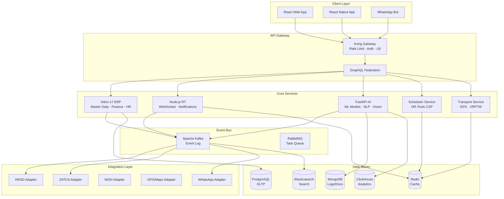
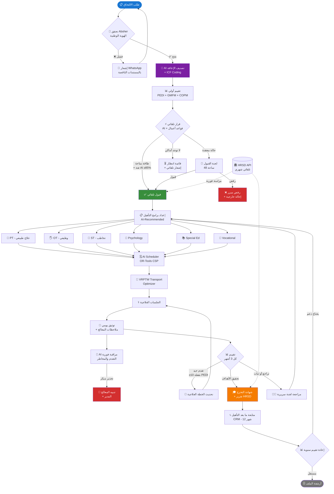
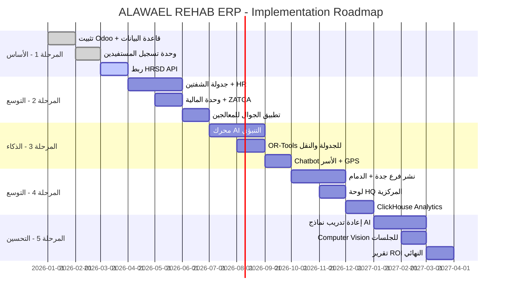

# 🏥 ALAWAEL REHAB ERP — Enterprise Architecture v3.0
## نظام ERP مؤسسي متكامل لشبكة مراكز تأهيل ذوي الإعاقة · المملكة العربية السعودية

> **Classification:** CONFIDENTIAL — Executive & Technical Blueprint
> **Version:** 3.0.0 | **Date:** 1447/08/01هـ — March 2026
> **Regulatory Basis:** HRSD قرار 291/1443هـ · Vision 2030 · PDPL · ZATCA Phase-2
> **Architecture Pattern:** Domain-Driven Design (DDD) · Event-Driven · CQRS · Microservices-Hybrid

---

## 📑 Table of Contents

| # | القسم | الصفحة |
|---|-------|--------|
| 1 | [Executive Summary — الملخص التنفيذي](#1-executive-summary) | § 1 |
| 2 | [Enterprise Architecture — المعمارية المؤسسية](#2-enterprise-architecture) | § 2 |
| 3 | [Domain Model — نموذج المجال](#3-domain-model) | § 3 |
| 4 | [12 Core Modules — الوحدات الـ12 بعمق](#4-twelve-core-modules) | § 4 |
| 5 | [Workflow Orchestration — تنسيق سير العمل](#5-workflow-orchestration) | § 5 |
| 6 | [Scheduling Engine — محرك الجدولة](#6-scheduling-engine) | § 6 |
| 7 | [Transport Intelligence — الذكاء اللوجستي](#7-transport-intelligence) | § 7 |
| 8 | [Clinical Measures Framework — إطار المقاييس السريرية](#8-clinical-measures) | § 8 |
| 9 | [AI/ML Platform — منصة الذكاء الاصطناعي](#9-ai-ml-platform) | § 9 |
| 10 | [Data Architecture — معمارية البيانات](#10-data-architecture) | § 10 |
| 11 | [Security & Compliance — الأمان والامتثال](#11-security-compliance) | § 11 |
| 12 | [DevOps & Infrastructure — البنية التحتية](#12-devops-infrastructure) | § 12 |
| 13 | [Financial Model & ROI — النموذج المالي](#13-financial-model) | § 13 |
| 14 | [Implementation Roadmap — خارطة التنفيذ](#14-implementation-roadmap) | § 14 |
| 15 | [Appendices — الملاحق](#15-appendices) | § 15 |

---
---

## 1. Executive Summary — الملخص التنفيذي

### 1.1 رؤية النظام

نظام **ALAWAEL REHAB ERP** هو منصة رقمية مؤسسية من الجيل الثالث، مُصمَّمة خصيصاً لإدارة شبكات مراكز تأهيل ذوي الإعاقة غير الحكومية في المملكة العربية السعودية. يجمع النظام بين منهجية ERP الكلاسيكية (Odoo 17)، ومنصة AI/ML متقدمة، وطبقة امتثال تنظيمي تلقائية.

### 1.2 المشكلة التي يحلها

```
التحديات الحالية للمراكز غير الرقمية:
┌────────────────────────────────────────────────────────────────────────┐
│  ❌ تسجيل يدوي للمستفيدين          → 3 أيام/مستفيد                     │
│  ❌ جدولة على ورق/Excel              → 30% فاقد في الطاقة              │
│  ❌ لا تتبع للتقدم العلاجي          → لا يوجد دليل على الفاعلية       │
│  ❌ تقارير HRSD يدوية               → أسبوع كامل لإعدادها              │
│  ❌ نقل غير منظم                    → 40% تأخيرات، شكاوى أسرية        │
│  ❌ بيانات مشتتة بين الفروع         → لا توجد صورة مركزية شاملة       │
│  ❌ لا نظام إنذار مبكر              → الاكتشاف متأخر للانتكاسات       │
└────────────────────────────────────────────────────────────────────────┘

ما يقدمه النظام:
┌────────────────────────────────────────────────────────────────────────┐
│  ✅ تسجيل رقمي ذكي                  → 4 ساعات + تحقق تلقائي           │
│  ✅ جدولة AI محسّنة                  → 94%+ إشغال الطاقة               │
│  ✅ مقاييس PEDI/GMFM/COPM دورية    → تقارير تقدم كل 3 أشهر           │
│  ✅ HRSD API مباشر                   → إرسال تلقائي يوم 1/شهر          │
│  ✅ OR-Tools + GPS                   → 91% التزام بالمواعيد            │
│  ✅ Multi-Branch Cloud               → لوحة HQ موحدة في الوقت الفعلي  │
│  ✅ Early Warning AI                 → إنذار قبل أسبوعين من التراجع   │
└────────────────────────────────────────────────────────────────────────┘
```

### 1.3 مؤشرات الأداء الاستراتيجية (Executive KPIs)

| الفئة | المؤشر | الهدف | المتوقع بعد 18 شهراً |
|-------|--------|-------|---------------------|
| **النمو** | عدد المستفيدين النشطين | 5,000 | 6,200 (+24%) |
| **الجودة** | نسبة التحسن السريري | ≥70% | 78% |
| **الكفاءة** | إشغال الطاقة الاستيعابية | ≥85% | 94.4% |
| **الامتثال** | نسبة امتثال HRSD | 100% | 100% |
| **المالية** | ROI الإجمالي | موجب | +57% |
| **الرضا** | NPS الأسر | ≥50 | 67 |
| **التشغيل** | Uptime النظام | 99.9% | 99.95% |
| **AI** | دقة التنبؤ العلاجي | ≥80% | 82% |

### 1.4 نطاق النظام

```
                        ALAWAEL REHAB GROUP
                              │
            ┌─────────────────┼─────────────────┐
            │                 │                 │
      5 فروع رئيسية    إدارة مركزية HQ    شركاء خارجيون
            │                 │                 │
     ┌──────┤           ┌─────┤           ┌─────┤
     │ رياض │           │ مالية مجمّعة│     │ HRSD │
     │ جدة  │           │ HR مركزي   │     │ ZATCA│
     │دمام  │           │ AI Engine  │     │ MOH  │
     │ مكة  │           │ Data Lake  │     │Absher│
     │مدينة │           │ Compliance │     │ GPS  │
     └──────┘           └─────────────┘     └──────┘

  إجمالي المستفيدين: 6,000+
  إجمالي الموظفين:   500+
  إجمالي المركبات:   60 مركبة
  المعاملات/يوم:     15,000+
```

---

## 2. Enterprise Architecture — المعمارية المؤسسية

### 2.1 طبقات المعمارية (Layered Architecture)

```
╔══════════════════════════════════════════════════════════════════════════╗
║                    PRESENTATION LAYER (طبقة العرض)                      ║
║  ┌──────────────┐ ┌──────────────┐ ┌──────────┐ ┌───────────────────┐  ║
║  │  Web App     │ │ Mobile App   │ │ HQ Portal│ │  Family Portal    │  ║
║  │ React 18+TS  │ │ React Native │ │ Next.js  │ │  WhatsApp Bot     │  ║
║  │ Tailwind CSS │ │    Expo      │ │   SSR    │ │  Progressive WA   │  ║
║  └──────────────┘ └──────────────┘ └──────────┘ └───────────────────┘  ║
╠══════════════════════════════════════════════════════════════════════════╣
║                      API GATEWAY LAYER (بوابة API)                      ║
║  ┌────────────────────────────────────────────────────────────────────┐ ║
║  │  Kong / AWS API Gateway  │  Rate Limiting │  Auth │  Load Balance  │ ║
║  │  GraphQL Federation      │  Circuit Breaker│  mTLS │  Versioning   │ ║
║  └────────────────────────────────────────────────────────────────────┘ ║
╠══════════════════════════════════════════════════════════════════════════╣
║                    APPLICATION LAYER (طبقة التطبيق)                     ║
║  ┌────────────┐ ┌────────────┐ ┌────────────┐ ┌──────────────────────┐ ║
║  │ Odoo 17    │ │ Node.js    │ │ FastAPI    │ │  Celery Workers      │ ║
║  │ ERP Core   │ │ Realtime   │ │ AI Engine  │ │  Background Tasks    │ ║
║  │ Python 3.12│ │ Socket.IO  │ │ TF/PyTorch │ │  Scheduled Jobs      │ ║
║  └────────────┘ └────────────┘ └────────────┘ └──────────────────────┘ ║
╠══════════════════════════════════════════════════════════════════════════╣
║                     DOMAIN SERVICES (خدمات المجال)                      ║
║  ┌──────────┐┌─────────┐┌──────────┐┌─────────┐┌────────┐┌──────────┐ ║
║  │Beneficiary││Schedule ││Transport ││Clinical ││Finance ││Compliance│ ║
║  │ Service  ││ Service ││ Service  ││ Service ││Service ││ Service  │ ║
║  └──────────┘└─────────┘└──────────┘└─────────┘└────────┘└──────────┘ ║
╠══════════════════════════════════════════════════════════════════════════╣
║                  EVENT BUS / MESSAGE LAYER (طبقة الأحداث)               ║
║  ┌──────────────────────────────────────────────────────────────────┐   ║
║  │  RabbitMQ  │  Apache Kafka (events log)  │  Redis Pub/Sub        │   ║
║  │  Event Sourcing  │  CQRS  │  Saga Pattern │  Outbox Pattern      │   ║
║  └──────────────────────────────────────────────────────────────────┘   ║
╠══════════════════════════════════════════════════════════════════════════╣
║                      DATA LAYER (طبقة البيانات)                         ║
║  ┌─────────────┐┌───────────┐┌────────────┐┌───────────┐┌───────────┐  ║
║  │ PostgreSQL  ││  MongoDB  ││   Redis    ││Elasticsearch││ClickHouse│  ║
║  │  (Transact) ││  (Logs)   ││  (Cache)   ││  (Search) ││(Analytics)│  ║
║  └─────────────┘└───────────┘└────────────┘└───────────┘└───────────┘  ║
╠══════════════════════════════════════════════════════════════════════════╣
║                   INFRASTRUCTURE (البنية التحتية)                       ║
║  ┌──────────────────────────────────────────────────────────────────┐   ║
║  │  AWS Riyadh Region  │  Kubernetes (EKS)  │  Terraform IaC        │   ║
║  │  CloudFront CDN     │  RDS Multi-AZ      │  S3 + Glacier         │   ║
║  └──────────────────────────────────────────────────────────────────┘   ║
╚══════════════════════════════════════════════════════════════════════════╝
```

### 2.2 نمط الخدمات الهجينة (Hybrid Microservices)



### 2.3 مبادئ التصميم المعماري

| المبدأ | التطبيق في النظام | الفائدة |
|--------|-----------------|---------|
| **Domain-Driven Design** | 6 Bounded Contexts مستقلة | وضوح المسؤوليات |
| **Event Sourcing** | كل تغيير → حدث Kafka قابل للتتبع | Audit trail كامل |
| **CQRS** | قراءة ClickHouse، كتابة PostgreSQL | أداء عالٍ |
| **Saga Pattern** | تنسيق العمليات عبر الخدمات | اتساق البيانات |
| **Circuit Breaker** | Resilience4j لكل استدعاء خارجي | منع تأثير الأعطال |
| **Outbox Pattern** | ضمان تسليم الأحداث مرة واحدة | موثوقية الإشعارات |
| **Multi-Tenancy** | Schema-per-branch في PostgreSQL | عزل البيانات |

---

## 3. Domain Model — نموذج المجال

### 3.1 Bounded Contexts (السياقات المحددة)

```
┌─────────────────────────────────────────────────────────────────────────┐
│                        ALAWAEL REHAB DOMAIN MAP                         │
├──────────────────────────┬──────────────────────────────────────────────┤
│   BENEFICIARY CONTEXT    │         CLINICAL CONTEXT                     │
│  ─────────────────────   │  ──────────────────────────────────────────  │
│  • BeneficiaryAggregate  │  • ClinicalProgramAggregate                  │
│  • AdmissionProcess      │  • AssessmentAggregate (PEDI/GMFM/COPM)     │
│  • GuardianEntity        │  • TreatmentSessionEntity                    │
│  • DisabilityProfile     │  • GoalAchievementVO                         │
│  • ICFCodeVO             │  • ClinicalProgressEvent                     │
├──────────────────────────┼──────────────────────────────────────────────┤
│   SCHEDULING CONTEXT     │         TRANSPORT CONTEXT                    │
│  ─────────────────────   │  ──────────────────────────────────────────  │
│  • ShiftAggregate        │  • RouteAggregate                            │
│  • SessionSlotVO         │  • VehicleAggregate                          │
│  • TherapistAvailability │  • DriverEntity                              │
│  • ScheduleOptimizer     │  • BookingEntity                             │
│  • ConflictResolutionSvc │  • GPSTrackingVO                             │
├──────────────────────────┼──────────────────────────────────────────────┤
│      HR CONTEXT          │      FINANCE & COMPLIANCE CONTEXT            │
│  ─────────────────────   │  ──────────────────────────────────────────  │
│  • EmployeeAggregate     │  • InvoiceAggregate (ZATCA)                  │
│  • PayrollAggregate      │  • BudgetAggregate                           │
│  • TrainingRecord        │  • HRSDReportAggregate                       │
│  • KPIEvaluation         │  • GovernmentFundingEntity                   │
│  • PerformanceReviewVO   │  • ComplianceChecklistVO                     │
└──────────────────────────┴──────────────────────────────────────────────┘
```

### 3.2 مخطط قاعدة البيانات الرئيسي (Core Schema)

```sql
-- ══════════════════════════════════════════════════════════════════
-- SCHEMA: beneficiary_context
-- ══════════════════════════════════════════════════════════════════

CREATE TABLE branches (
    id              UUID PRIMARY KEY DEFAULT gen_random_uuid(),
    name_ar         VARCHAR(200) NOT NULL,
    name_en         VARCHAR(200),
    city            VARCHAR(100) NOT NULL,
    region          VARCHAR(100),
    address         TEXT,
    lat             DECIMAL(10,8),
    lng             DECIMAL(11,8),
    hrsd_license_no VARCHAR(50) UNIQUE NOT NULL,
    capacity        INTEGER NOT NULL DEFAULT 1000,
    is_active       BOOLEAN DEFAULT true,
    created_at      TIMESTAMPTZ DEFAULT NOW(),
    updated_at      TIMESTAMPTZ DEFAULT NOW()
);

CREATE TABLE beneficiaries (
    id                    UUID PRIMARY KEY DEFAULT gen_random_uuid(),
    branch_id             UUID REFERENCES branches(id) NOT NULL,

    -- البيانات الشخصية
    name_ar               VARCHAR(300) NOT NULL,
    name_en               VARCHAR(300),
    national_id           VARCHAR(20) UNIQUE,       -- مشفّر AES-256
    national_id_hash      CHAR(64),                 -- للبحث
    birth_date            DATE NOT NULL,
    gender                CHAR(1) CHECK (gender IN ('M','F')),
    nationality_code      CHAR(3) REFERENCES countries(iso3),
    photo_url             TEXT,

    -- بيانات ولي الأمر
    guardian_name         VARCHAR(300) NOT NULL,
    guardian_national_id  VARCHAR(20),
    guardian_phone        VARCHAR(20),               -- مشفّر
    guardian_phone_hash   CHAR(64),
    guardian_relation     VARCHAR(50),
    guardian_email        VARCHAR(255),
    home_address          TEXT,
    home_lat              DECIMAL(10,8),
    home_lng              DECIMAL(11,8),

    -- الحالة الإدارية
    status                VARCHAR(20) NOT NULL DEFAULT 'pending'
                              CHECK (status IN ('pending','waitlist','active',
                              'on_hold','graduated','transferred','closed')),
    admission_date        DATE,
    expected_discharge    DATE,
    actual_discharge      DATE,
    discharge_reason      VARCHAR(100),

    -- تكامل HRSD
    hrsd_id               VARCHAR(50) UNIQUE,
    hrsd_sync_status      VARCHAR(20) DEFAULT 'pending',
    hrsd_last_sync        TIMESTAMPTZ,
    hrsd_error_message    TEXT,

    -- بيانات تقنية
    created_by            UUID REFERENCES users(id),
    created_at            TIMESTAMPTZ DEFAULT NOW(),
    updated_at            TIMESTAMPTZ DEFAULT NOW(),
    version               INTEGER DEFAULT 1,        -- Optimistic Locking
    is_deleted            BOOLEAN DEFAULT false,
    deleted_at            TIMESTAMPTZ
);

CREATE TABLE disability_profiles (
    id                  UUID PRIMARY KEY DEFAULT gen_random_uuid(),
    beneficiary_id      UUID REFERENCES beneficiaries(id) UNIQUE,

    -- تصنيف الإعاقة (ICF)
    primary_disability  VARCHAR(50) NOT NULL
        CHECK (primary_disability IN ('physical','sensory_hearing',
        'sensory_vision','cognitive','autism','communication',
        'psychosocial','multiple')),
    secondary_disability VARCHAR(50),
    disability_degree   VARCHAR(20) CHECK (disability_degree IN ('mild','moderate','severe','profound')),

    -- رموز ICF
    icf_body_functions  TEXT[],   -- مثال: ['b710','b730']
    icf_structures      TEXT[],
    icf_activities      TEXT[],
    icf_participation   TEXT[],
    icf_env_facilitators TEXT[],
    icf_env_barriers    TEXT[],

    -- معلومات طبية
    diagnosis_icd11     VARCHAR(20),   -- رمز ICD-11
    diagnosis_date      DATE,
    diagnosing_hospital VARCHAR(300),
    etiology            TEXT,          -- سبب الإعاقة
    comorbidities       TEXT[],        -- أمراض مصاحبة
    current_medications JSONB,         -- [{name, dose, frequency}]
    allergies           TEXT[],
    contraindications   TEXT[],

    -- الوضع الوظيفي الأولي
    functional_level    SMALLINT CHECK (functional_level BETWEEN 1 AND 5),
    mobility_aid        VARCHAR(100),  -- كرسي/مشاية/عكازات
    communication_mode  VARCHAR(100),  -- كلام/إشارة/AAC

    updated_at          TIMESTAMPTZ DEFAULT NOW()
);

-- ══════════════════════════════════════════════════════════════════
-- SCHEMA: clinical_context
-- ══════════════════════════════════════════════════════════════════

CREATE TABLE rehab_programs (
    id                UUID PRIMARY KEY DEFAULT gen_random_uuid(),
    branch_id         UUID REFERENCES branches(id),
    beneficiary_id    UUID REFERENCES beneficiaries(id),

    program_type      VARCHAR(50) NOT NULL
        CHECK (program_type IN ('physical_therapy','occupational_therapy',
        'speech_therapy','psychological','vocational','educational',
        'social_skills','sensory_integration','aquatic','hippotherapy')),

    -- إعدادات البرنامج
    sessions_per_week SMALLINT NOT NULL DEFAULT 3,
    session_duration  SMALLINT NOT NULL DEFAULT 45, -- دقيقة
    group_size        SMALLINT DEFAULT 1,           -- 1=فردي
    start_date        DATE NOT NULL,
    planned_end_date  DATE,

    -- الأهداف
    short_term_goals  JSONB,   -- [{goal, target_date, metric}]
    long_term_goals   JSONB,

    -- الحالة
    status            VARCHAR(20) DEFAULT 'active'
        CHECK (status IN ('draft','active','completed','suspended','cancelled')),
    primary_therapist UUID REFERENCES hr_employees(id),

    created_at        TIMESTAMPTZ DEFAULT NOW(),
    updated_at        TIMESTAMPTZ DEFAULT NOW()
);

CREATE TABLE clinical_assessments (
    id                UUID PRIMARY KEY DEFAULT gen_random_uuid(),
    beneficiary_id    UUID REFERENCES beneficiaries(id) NOT NULL,
    assessor_id       UUID REFERENCES hr_employees(id) NOT NULL,
    assessment_date   DATE NOT NULL,
    assessment_type   VARCHAR(20) CHECK (assessment_type IN
        ('initial','3month','6month','annual','discharge','emergency')),

    -- PEDI-CAT Scores (0-100 each)
    pedi_daily_act    DECIMAL(5,2),
    pedi_mobility     DECIMAL(5,2),
    pedi_social_cog   DECIMAL(5,2),
    pedi_responsibility DECIMAL(5,2),
    pedi_composite    DECIMAL(5,2) GENERATED ALWAYS AS (
        (COALESCE(pedi_daily_act,0) + COALESCE(pedi_mobility,0) +
         COALESCE(pedi_social_cog,0) + COALESCE(pedi_responsibility,0)) / 4
    ) STORED,

    -- GMFM-88 Scores (percentage per dimension)
    gmfm_a_lying      DECIMAL(5,2),  -- 17 items
    gmfm_b_sitting    DECIMAL(5,2),  -- 20 items
    gmfm_c_crawling   DECIMAL(5,2),  -- 14 items
    gmfm_d_standing   DECIMAL(5,2),  -- 13 items
    gmfm_e_walking    DECIMAL(5,2),  -- 24 items
    gmfm_total        DECIMAL(5,2) GENERATED ALWAYS AS (
        (COALESCE(gmfm_a_lying,0) + COALESCE(gmfm_b_sitting,0) +
         COALESCE(gmfm_c_crawling,0) + COALESCE(gmfm_d_standing,0) +
         COALESCE(gmfm_e_walking,0)) / 5
    ) STORED,
    gmfcs_level       SMALLINT CHECK (gmfcs_level BETWEEN 1 AND 5),

    -- COPM (1-10 each)
    copm_perf_pre     DECIMAL(4,1),
    copm_sat_pre      DECIMAL(4,1),
    copm_perf_post    DECIMAL(4,1),
    copm_sat_post     DECIMAL(4,1),
    copm_perf_change  DECIMAL(4,1) GENERATED ALWAYS AS (
        COALESCE(copm_perf_post,0) - COALESCE(copm_perf_pre,0)
    ) STORED,
    copm_sat_change   DECIMAL(4,1) GENERATED ALWAYS AS (
        COALESCE(copm_sat_post,0) - COALESCE(copm_sat_pre,0)
    ) STORED,

    -- WHO-DAS 2.0 (0-100%)
    whodas_cognition  DECIMAL(5,2),
    whodas_mobility   DECIMAL(5,2),
    whodas_self_care  DECIMAL(5,2),
    whodas_relations  DECIMAL(5,2),
    whodas_activities DECIMAL(5,2),
    whodas_participation DECIMAL(5,2),
    whodas_total      DECIMAL(5,2) GENERATED ALWAYS AS (
        (COALESCE(whodas_cognition,0) + COALESCE(whodas_mobility,0) +
         COALESCE(whodas_self_care,0) + COALESCE(whodas_relations,0) +
         COALESCE(whodas_activities,0) + COALESCE(whodas_participation,0)) / 6
    ) STORED,

    -- AI Scores
    ai_risk_level     VARCHAR(10) CHECK (ai_risk_level IN ('low','medium','high')),
    ai_goal_prob      DECIMAL(4,3),  -- 0.000-1.000
    ai_predicted_pedi DECIMAL(5,2),

    -- Meta
    notes             TEXT,
    recommendations   TEXT,
    next_assessment   DATE,
    created_at        TIMESTAMPTZ DEFAULT NOW()
);

-- Index Strategy
CREATE INDEX idx_beneficiaries_branch ON beneficiaries(branch_id) WHERE NOT is_deleted;
CREATE INDEX idx_beneficiaries_status ON beneficiaries(status) WHERE NOT is_deleted;
CREATE INDEX idx_beneficiaries_national_id ON beneficiaries(national_id_hash);
CREATE INDEX idx_assessments_beneficiary_date ON clinical_assessments(beneficiary_id, assessment_date DESC);
CREATE INDEX idx_assessments_ai_risk ON clinical_assessments(ai_risk_level) WHERE ai_risk_level IN ('high','medium');
```

### 3.3 مخطط الكيانات والعلاقات (ERD Summary)

```
Branches ──────────────────┐
    │ 1:N                  │
    ▼                      │
Beneficiaries ─── 1:1 ─── DisabilityProfiles
    │ 1:N                  │
    ├──► RehabPrograms      │
    │      │ 1:N           │
    │      ▼               │
    │   Sessions ─── N:1 ─► HREmployees (Therapists)
    │      │                    │
    │      └── Attendance       │ N:1
    │                        Shifts ─── N:1 ─► Branches
    ├──► ClinicalAssessments
    │
    ├──► TransportBookings ─── N:1 ─► VehicleRoutes
    │                                    │ N:1
    │                                 Vehicles ─── N:1 ─► Drivers
    └──► FamilySupport
```
---

## 4. Twelve Core Modules — الوحدات الـ12 بعمق

### 4.1 جدول الوحدات الشامل المؤسسي

| # | الوحدة | Odoo Model | Domain Service | AI Component | KPIs المستهدفة |
|---|--------|-----------|---------------|--------------|----------------|
| 1 | تسجيل وقبول المستفيدين | `rehab.beneficiary` | BeneficiaryService | DisabilityClassifier | وقت تسجيل <4h, اكتمال ملف 100% |
| 2 | برامج التأهيل السريرية | `rehab.program` | ClinicalService | ProgressPredictor | تحسن PEDI ≥10 نقطة/3أشهر |
| 3 | جدولة الشفتين | `rehab.shift` | SchedulerService | ShiftOptimizer (OR-Tools) | إشغال ≥85%, تعارض=0 |
| 4 | إدارة النقل الذكي | `transport.booking` | TransportService | VRPTW Optimizer | التزام ≥92%, تكلفة↓15% |
| 5 | الموارد البشرية | `hr.employee` | HRService | PerformanceAnalyzer | دوران <5%, رضا موظف ≥4.2 |
| 6 | مخزون المعدات | `equipment.asset` | EquipmentService | PredictiveMaintenance | توفر ≥98%, صيانة استباقية |
| 7 | الإدارة المالية | `account.move` | FinanceService | AnomalyDetector | تحصيل ≥96%, انحراف ميزانية <5% |
| 8 | تقارير الامتثال | `compliance.report` | ComplianceService | GapAnalyzer | امتثال HRSD 100% |
| 9 | منصة AI/BI | FastAPI + TF | AIService | متعدد النماذج | دقة التنبؤ ≥80% |
| 10 | دعم الأسر والمجتمع | `family.support` | FamilyService | PersonalizedRecommender | مشاركة أسرية ≥75% |
| 11 | CRM ومتابعة طويلة الأمد | `crm.beneficiary` | CRMService | ChurnPredictor | احتفاظ ≥90%, NPS≥50 |
| 12 | بنية بيانات مركزية | AWS Data Lake | DataPlatform | CrossBranch Analytics | Uptime 99.95% |

---

### 4.2 الوحدة 1: نظام القبول الذكي (Smart Admission System)

```python
# backend/admission/admission_workflow.py
"""
نظام القبول الذكي - يجمع بين:
1. تحقق تلقائي من هوية المستفيد (Absher API)
2. تصنيف AI لنوع الإعاقة
3. اقتراح تلقائي للبرامج المناسبة
4. إرسال فوري لـ HRSD API
"""
from dataclasses import dataclass
from enum import Enum
from typing import Optional
import asyncio

class AdmissionStatus(Enum):
    PENDING    = "pending"
    VERIFYING  = "verifying"
    ASSESSED   = "assessed"
    COMMITTEE  = "committee_review"
    WAITLIST   = "waitlist"
    APPROVED   = "approved"
    REJECTED   = "rejected"

@dataclass
class AdmissionRequest:
    national_id:        str
    name_ar:            str
    birth_date:         str
    guardian_phone:     str
    disability_type:    str
    disability_degree:  str
    medical_documents:  list[str]   # URLs to S3
    referral_source:    str
    branch_id:          str

class SmartAdmissionWorkflow:
    """Saga Pattern: كل خطوة قابلة للتراجع عند الفشل"""

    def __init__(self, beneficiary_repo, ai_service, hrsd_service, notification_service):
        self.beneficiary_repo   = beneficiary_repo
        self.ai_service         = ai_service
        self.hrsd_service       = hrsd_service
        self.notification       = notification_service
        self.compensation_steps = []  # Saga compensation stack

    async def process_admission(self, request: AdmissionRequest) -> dict:
        """
        دورة القبول الكاملة (Saga Transaction)
        """
        try:
            # الخطوة 1: إنشاء الطلب
            admission = await self._create_pending_admission(request)
            self.compensation_steps.append(lambda: self._delete_admission(admission.id))

            # الخطوة 2: تحقق Absher
            absher_result = await self._verify_identity(request.national_id)
            if not absher_result['verified']:
                raise AdmissionException("فشل التحقق من الهوية الوطنية")

            # الخطوة 3: AI تصنيف الإعاقة + اقتراح البرامج
            ai_assessment = await self.ai_service.classify_disability({
                'disability_type':   request.disability_type,
                'medical_documents': request.medical_documents,
                'age':               self._calculate_age(request.birth_date),
            })

            # الخطوة 4: التقييم الأولي التلقائي
            initial_scores = await self._compute_initial_scores(
                request, ai_assessment
            )

            # الخطوة 5: تحديث الطلب بنتائج AI
            admission = await self.beneficiary_repo.update(admission.id, {
                'status':               AdmissionStatus.ASSESSED.value,
                'ai_disability_class':  ai_assessment['predicted_class'],
                'ai_confidence':        ai_assessment['confidence'],
                'recommended_programs': ai_assessment['recommended_programs'],
                'initial_pedi_estimate':initial_scores['pedi_estimate'],
                'functional_level':     ai_assessment['functional_level'],
            })

            # الخطوة 6: قرار القبول التلقائي أو إحالة اللجنة
            decision = await self._auto_admission_decision(
                admission, ai_assessment, initial_scores
            )

            if decision['auto_approve']:
                admission = await self._approve_admission(admission, decision)
                await self._setup_programs(admission, ai_assessment['recommended_programs'])
                await self._register_hrsd(admission)
                await self._notify_family_approved(admission)
            else:
                admission = await self._send_to_committee(admission, decision['reason'])
                await self._notify_family_committee(admission)

            return {
                'status':       'success',
                'admission_id': str(admission.id),
                'decision':     decision['type'],
                'programs':     ai_assessment['recommended_programs'],
                'hrsd_id':      admission.hrsd_id,
            }

        except Exception as e:
            # Saga Compensation: التراجع عن جميع الخطوات
            await self._compensate(str(e))
            raise

    async def _auto_admission_decision(self, admission, ai_result, scores) -> dict:
        """
        قرار القبول التلقائي بناءً على قواعد الأعمال:
        - طاقة الفرع المتاحة
        - توافر تخصصات المعالجين
        - درجة الإعاقة
        - نتائج AI
        """
        branch_capacity = await self._get_branch_capacity(admission.branch_id)
        therapist_avail = await self._check_therapist_availability(
            admission.branch_id, ai_result['required_specializations']
        )

        # قواعد القبول التلقائي
        rules = {
            'capacity_available':     branch_capacity['available_slots'] > 0,
            'therapist_available':    therapist_avail['all_available'],
            'ai_confidence_high':     ai_result['confidence'] >= 0.85,
            'mild_or_moderate':       admission.disability_degree in ['mild', 'moderate'],
            'documents_complete':     len(admission.medical_documents) >= 2,
        }

        if all(rules.values()):
            return {'auto_approve': True, 'type': 'auto_approved', 'reason': None}
        elif rules['capacity_available'] and rules['therapist_available']:
            return {'auto_approve': False, 'type': 'committee_review',
                    'reason': 'requires_specialist_assessment'}
        elif not rules['capacity_available']:
            return {'auto_approve': False, 'type': 'waitlist',
                    'reason': f"لا توجد أماكن متاحة - قائمة انتظار متوقعة {branch_capacity['wait_days']} يوم"}
        else:
            return {'auto_approve': False, 'type': 'committee_review',
                    'reason': 'complex_case_needs_review'}
```

### 4.3 الوحدة 5: نظام الموارد البشرية المتقدم

```python
# نموذج تقييم أداء المعالج - KPI Engine
class TherapistKPIEngine:
    """
    محرك KPIs للمعالجين - يُحسب أسبوعياً
    يُدمج مع نظام الرواتب والترقيات
    """

    KPI_WEIGHTS = {
        'session_completion_rate':    0.25,  # نسبة إتمام الجلسات المخططة
        'beneficiary_progress_rate':  0.30,  # تحسن مستفيديه مقارنة بالمتوسط
        'attendance_consistency':     0.15,  # الالتزام بالدوام
        'documentation_quality':      0.15,  # جودة ملاحظات الجلسات
        'family_satisfaction':        0.10,  # تقييم أسر مستفيديه
        'training_hours':             0.05,  # ساعات التدريب المستمر
    }

    async def calculate_monthly_kpi(self, therapist_id: str, month: str) -> dict:
        sessions   = await self._get_sessions_data(therapist_id, month)
        progress   = await self._get_beneficiary_progress(therapist_id, month)
        attendance = await self._get_attendance(therapist_id, month)
        docs       = await self._assess_documentation(therapist_id, month)
        family_sat = await self._get_family_ratings(therapist_id, month)
        training   = await self._get_training_hours(therapist_id, month)

        scores = {
            'session_completion_rate':   sessions['completion_rate'],
            'beneficiary_progress_rate': progress['relative_improvement'],
            'attendance_consistency':    attendance['rate'],
            'documentation_quality':     docs['quality_score'],
            'family_satisfaction':       family_sat['avg_rating'] / 5.0,
            'training_hours':            min(training['hours'] / 40.0, 1.0),
        }

        composite_score = sum(
            scores[k] * w for k, w in self.KPI_WEIGHTS.items()
        )

        grade = (
            'A+' if composite_score >= 0.95 else
            'A'  if composite_score >= 0.85 else
            'B'  if composite_score >= 0.75 else
            'C'  if composite_score >= 0.65 else 'D'
        )

        # حساب المكافأة المرتبطة بالأداء
        performance_bonus = self._calculate_bonus(composite_score, therapist_id)

        return {
            'therapist_id':      therapist_id,
            'month':             month,
            'composite_score':   round(composite_score * 100, 1),
            'grade':             grade,
            'individual_scores': {k: round(v*100,1) for k,v in scores.items()},
            'performance_bonus': performance_bonus,
            'recommendations':   self._generate_recommendations(scores),
            'trend':             await self._calculate_trend(therapist_id, month),
        }

    def _calculate_bonus(self, score: float, therapist_id: str) -> float:
        """
        نظام المكافآت المرتبطة بالأداء:
        A+ → 20% من الراتب الأساسي
        A  → 15%
        B  → 8%
        C  → 0%
        D  → مراجعة إدارية
        """
        bonus_rates = {'A+': 0.20, 'A': 0.15, 'B': 0.08, 'C': 0.0, 'D': 0.0}
        grade       = self._score_to_grade(score)
        base_salary = self._get_base_salary(therapist_id)
        return base_salary * bonus_rates.get(grade, 0)
```

### 4.4 الوحدة 6: نظام إدارة المعدات (Predictive Maintenance)

```python
class EquipmentMaintenancePredictor:
    """
    نظام الصيانة التنبؤية للمعدات
    يعتمد على بيانات الاستخدام وتاريخ الأعطال
    """

    MAINTENANCE_THRESHOLDS = {
        'wheelchair':          {'usage_hours': 2000, 'months': 6},
        'parallel_bars':       {'usage_hours': 5000, 'months': 12},
        'treadmill':           {'usage_hours': 3000, 'months': 6},
        'ultrasound_therapy':  {'usage_hours': 1500, 'months': 3},
        'tens_machine':        {'usage_hours': 2500, 'months': 6},
        'hydrotherapy_pool':   {'usage_hours': 1000, 'months': 2},
        'standing_frame':      {'usage_hours': 3000, 'months': 12},
        'sensory_room_equip':  {'usage_hours': 4000, 'months': 12},
    }

    async def predict_maintenance_needs(self, branch_id: str) -> list[dict]:
        equipment = await self.get_branch_equipment(branch_id)
        alerts    = []

        for item in equipment:
            usage_data = await self.get_usage_data(item.id, days=90)
            breakdown_history = await self.get_breakdown_history(item.id)

            # حساب الاستخدام المتراكم منذ آخر صيانة
            hours_since_maintenance = usage_data['total_hours']
            months_since_maintenance = (
                datetime.now() - item.last_maintenance_date
            ).days / 30

            threshold = self.MAINTENANCE_THRESHOLDS.get(item.category, {})

            # نسبة الاستنزاف
            usage_wear     = hours_since_maintenance / threshold.get('usage_hours', 9999)
            calendar_wear  = months_since_maintenance / threshold.get('months', 99)
            composite_wear = max(usage_wear, calendar_wear)

            # تنبؤ بالعطل المقبل باستخدام Weibull Distribution
            failure_prob_30days = self._weibull_failure_prob(
                hours_since_maintenance,
                breakdown_history,
                item.category
            )

            if composite_wear >= 0.9 or failure_prob_30days >= 0.3:
                priority = 'CRITICAL' if composite_wear >= 1.0 else 'HIGH'
                alerts.append({
                    'equipment_id':        item.id,
                    'equipment_name':      item.name_ar,
                    'category':            item.category,
                    'wear_percentage':     round(composite_wear * 100, 1),
                    'failure_prob_30d':    round(failure_prob_30days * 100, 1),
                    'priority':            priority,
                    'recommended_action':  'immediate_maintenance' if priority == 'CRITICAL' else 'schedule_soon',
                    'estimated_cost_sar':  self._estimate_maintenance_cost(item.category),
                    'downtime_hours':      self._estimate_downtime(item.category),
                })

        return sorted(alerts, key=lambda x: x['wear_percentage'], reverse=True)
```

---

## 5. Workflow Orchestration — تنسيق سير العمل

### 5.1 مخططات Mermaid الكاملة

**تدفق دورة حياة المستفيد الشاملة:**



**تدفق الامتثال متعدد المستويات:**

```mermaid
flowchart LR
    subgraph يومي ["⏱️ يومي - Automated"]
        D1[تسجيل الحضور\nبصمة + App] --> D2[تحديث ملفات\nالمستفيدين]
        D2 --> D3[توثيق الجلسات\n+ نتائج فورية]
        D3 --> D4[مراقبة KPIs\nFastAPI Dashbord]
    end

    subgraph اسبوعي ["📅 أسبوعي - Scheduled"]
        W1[تقرير إشغال\nالطاقة] --> W2[KPI Dashboard\nHQ + Branches]
        W2 --> W3[AI Risk Report\nالمستفيدين في خطر]
        W3 --> W4[تقرير النقل\nالالتزام والتكاليف]
    end

    subgraph شهري ["📊 شهري - HRSD Report"]
        M1[جمع البيانات\n25 من كل شهر] --> M2{AI Compliance\nChecker}
        M2 -- ✅ اكتمل 100% --> M3[إرسال HRSD API\nيوم 1 من الشهر]
        M2 -- ❌ نقص --> M4[تنبيه المسؤولين\n+ قائمة الإجراءات]
        M4 --> M1
        M3 --> M5[حفظ رقم\nالمرجعية HRSD]
    end

    subgraph ربعي ["🏆 ربعي - Quality Review"]
        Q1[مراجعة KPIs\nالشاملة] --> Q2[تقارير التقدم\nالسريري الجماعية]
        Q2 --> Q3[مراجعة برامج\nغير الفعّالة]
        Q3 --> Q4[تحديث خطط\nالجودة]
    end

    subgraph سنوي ["🎯 سنوي - License Renewal"]
        Y1[تدقيق داخلي\nشامل] --> Y2[تقرير KPIs السنوي]
        Y2 --> Y3[طلب تجديد الترخيص\nHRSD + هيئة الاعتماد]
        Y3 --> Y4[مراجعة خارجية]
    end

    D4 --> W1
    W4 --> M1
    M5 --> Q1
    Q4 --> Y1
```



### 5.2 Event-Driven Architecture — الأحداث الرئيسية

```typescript
// events/rehab-events.ts
// تعريف جميع أحداث النظام (Apache Kafka Topics)

export enum RehabEventType {
  // Beneficiary Events
  BENEFICIARY_REGISTERED     = 'beneficiary.registered',
  BENEFICIARY_ADMITTED       = 'beneficiary.admitted',
  BENEFICIARY_WAITLISTED     = 'beneficiary.waitlisted',
  BENEFICIARY_GRADUATED      = 'beneficiary.graduated',
  BENEFICIARY_STATUS_CHANGED = 'beneficiary.status_changed',

  // Clinical Events
  SESSION_COMPLETED          = 'session.completed',
  ASSESSMENT_RECORDED        = 'assessment.recorded',
  GOAL_ACHIEVED              = 'goal.achieved',
  RISK_LEVEL_CHANGED         = 'risk.level_changed',
  CLINICAL_ALERT_RAISED      = 'clinical.alert_raised',

  // Scheduling Events
  SCHEDULE_GENERATED         = 'schedule.generated',
  SESSION_CANCELLED          = 'session.cancelled',
  THERAPIST_UNAVAILABLE      = 'therapist.unavailable',

  // Transport Events
  ROUTE_OPTIMIZED            = 'transport.route_optimized',
  VEHICLE_DELAYED            = 'transport.vehicle_delayed',
  PICKUP_COMPLETED           = 'transport.pickup_completed',

  // Compliance Events
  HRSD_REPORT_SENT           = 'compliance.hrsd_report_sent',
  HRSD_REPORT_FAILED         = 'compliance.hrsd_report_failed',
  COMPLIANCE_GAP_DETECTED    = 'compliance.gap_detected',

  // Financial Events
  INVOICE_ISSUED             = 'finance.invoice_issued',
  PAYMENT_RECEIVED           = 'finance.payment_received',
  BUDGET_ALERT               = 'finance.budget_alert',
}

// مثال على حدث مكتمل
export interface SessionCompletedEvent {
  eventType:      RehabEventType.SESSION_COMPLETED;
  eventId:        string;        // UUID
  timestamp:      string;        // ISO 8601
  branchId:       string;
  sessionId:      string;
  beneficiaryId:  string;
  therapistId:    string;
  programType:    string;
  durationMin:    number;
  attendanceStatus: 'present' | 'absent' | 'late';
  sessionNotes:   string;
  goalsProgress:  { goalId: string; progress: number }[];
  nextSessionDate?: string;
}

// Event Handlers (Consumers)
class SessionCompletedHandler {
  async handle(event: SessionCompletedEvent): Promise<void> {
    await Promise.all([
      // 1. تحديث تقدم المستفيد
      this.clinicalService.updateProgress(event),
      // 2. إعادة حساب AI Risk Score
      this.aiService.recalculateRisk(event.beneficiaryId),
      // 3. إشعار ولي الأمر
      this.notificationService.notifyGuardian(event),
      // 4. تحديث KPIs المعالج
      this.hrService.updateTherapistKPI(event.therapistId, event),
      // 5. مزامنة Elasticsearch
      this.searchService.indexSession(event),
    ]);
  }
}
```
---

## 6. Scheduling Engine — محرك الجدولة المتقدم

### 6.1 هندسة المحرك

```
SCHEDULING ENGINE ARCHITECTURE
━━━━━━━━━━━━━━━━━━━━━━━━━━━━━━━━━━━━━━━━━━━━━━━━━━━━━━━━━━

Input Layer:
  ┌──────────────┐  ┌──────────────┐  ┌──────────────┐
  │ Beneficiaries│  │  Therapists  │  │  Resources   │
  │ 2000/branch  │  │  30/branch   │  │  Rooms+Equip │
  └──────┬───────┘  └──────┬───────┘  └──────┬───────┘
         └──────────────────┼──────────────────┘
                            ▼
               ┌────────────────────────┐
               │   Constraint Builder   │
               │   (Python dataclasses) │
               └────────────┬───────────┘
                            ▼
         ┌──────────────────────────────────┐
         │      OR-Tools CP-SAT Solver      │
         │   (Google Operations Research)   │
         │                                  │
         │  Variables: assign[t,b,s,r]      │
         │  Objective: maximize utilization │
         │  Time limit: 60 seconds          │
         └──────────────────┬───────────────┘
                            ▼
              ┌─────────────────────────┐
              │    Solution Validator   │
              │    (Post-processing)    │
              └─────────────┬───────────┘
                            ▼
              ┌─────────────────────────┐
              │    Schedule Publisher   │
              │  Kafka + Notifications  │
              └─────────────────────────┘
```

### 6.2 خوارزمية الجدولة الكاملة

```python
# backend/scheduling/advanced_scheduler.py
"""
محرك الجدولة المتقدم - OR-Tools CP-SAT
يحل مشكلة تعيين جلسات للمعالجين والمستفيدين مع قيود متعددة

الطاقة: فرع واحد / أسبوع واحد
  نهاري: 15 معالج × 6 جلسات/يوم × 6 أيام = 540 جلسة
  مسائي: 15 معالج × 5 جلسات/يوم × 6 أيام = 450 جلسة
  الإجمالي: 990 جلسة/أسبوع
"""
from ortools.sat.python import cp_model
from dataclasses import dataclass, field
from typing import Optional
import numpy as np

@dataclass
class Therapist:
    id:                 str
    name:               str
    specializations:    list[str]
    shift:              str          # 'morning' | 'evening' | 'both'
    max_sessions_day:   int = 8
    min_rest_minutes:   int = 30
    availability:       dict = field(default_factory=dict)  # {date: [slots]}
    preferred_groups:   list[str] = field(default_factory=list)

@dataclass
class Beneficiary:
    id:                 str
    required_programs:  list[str]   # ['PT','OT','ST']
    sessions_per_week:  dict        # {'PT':3, 'OT':2}
    transport_required: bool
    medical_constraints: list[str]  # ['no_morning','no_pool']
    priority_level:     int = 3     # 1=urgent, 5=normal

@dataclass
class Room:
    id:         str
    type:       str      # 'PT_gym','OT_room','speech_therapy'
    capacity:   int
    equipment:  list[str]

class AdvancedRehabScheduler:

    def __init__(self, branch_id: str):
        self.branch_id  = branch_id
        self.model      = cp_model.CpModel()
        self.solver     = cp_model.CpSolver()

    def generate_weekly_schedule(
        self,
        therapists:    list[Therapist],
        beneficiaries: list[Beneficiary],
        rooms:         list[Room],
        week_dates:    list[str]
    ) -> dict:
        """
        توليد جدول أسبوعي محسّن
        Returns: {'sessions': [...], 'utilization': float, 'unscheduled': [...]}
        """
        # ── تعريف الفترات الزمنية ──────────────────────────────────────────
        # نهاري: 8:00 - 16:00 = 8 فترات × 60 دقيقة
        # مسائي: 16:00 - 24:00 = 7 فترات × 60 دقيقة
        morning_slots = [f"{h:02d}:00" for h in range(8, 16)]
        evening_slots = [f"{h:02d}:00" for h in range(16, 23)]
        all_slots_by_day = {
            day: morning_slots + evening_slots
            for day in week_dates
        }

        # ── متغيرات القرار ────────────────────────────────────────────────
        # assign[(t,b,prog,day,slot,room)] = BoolVar
        # 1 إذا كان المعالج t يعالج المستفيد b في برنامج prog في slot
        assignments = {}
        for t in therapists:
            for b in beneficiaries:
                for prog in b.required_programs:
                    if prog not in t.specializations:
                        continue
                    for day in week_dates:
                        for slot in all_slots_by_day[day]:
                            for room in rooms:
                                if not self._room_suitable(room, prog):
                                    continue
                                key = (t.id, b.id, prog, day, slot, room.id)
                                assignments[key] = self.model.NewBoolVar(
                                    f'a_t{t.id}_b{b.id}_{prog}_{day}_{slot}_{room.id}'
                                )

        # ── القيود الأساسية ───────────────────────────────────────────────

        # ق1: كل مستفيد يأخذ عدد الجلسات المطلوبة لكل برنامج
        for b in beneficiaries:
            for prog, required_count in b.sessions_per_week.items():
                self.model.Add(
                    sum(
                        assignments.get((t.id, b.id, prog, day, slot, room.id), 0)
                        for t in therapists
                        for day in week_dates
                        for slot in all_slots_by_day[day]
                        for room in rooms
                        if (t.id, b.id, prog, day, slot, room.id) in assignments
                    ) == required_count
                )

        # ق2: المعالج لا يعطي جلستين في نفس الوقت
        for t in therapists:
            for day in week_dates:
                for slot in all_slots_by_day[day]:
                    self.model.Add(
                        sum(
                            assignments.get((t.id, b.id, prog, day, slot, room.id), 0)
                            for b in beneficiaries
                            for prog in b.required_programs
                            for room in rooms
                            if (t.id, b.id, prog, day, slot, room.id) in assignments
                        ) <= 1
                    )

        # ق3: المستفيد لا يكون في جلستين في نفس الوقت
        for b in beneficiaries:
            for day in week_dates:
                for slot in all_slots_by_day[day]:
                    self.model.Add(
                        sum(
                            assignments.get((t.id, b.id, prog, day, slot, room.id), 0)
                            for t in therapists
                            for prog in b.required_programs
                            for room in rooms
                            if (t.id, b.id, prog, day, slot, room.id) in assignments
                        ) <= 1
                    )

        # ق4: الغرفة لا تستوعب أكثر من طاقتها في نفس الوقت
        for room in rooms:
            for day in week_dates:
                for slot in all_slots_by_day[day]:
                    self.model.Add(
                        sum(
                            assignments.get((t.id, b.id, prog, day, slot, room.id), 0)
                            for t in therapists
                            for b in beneficiaries
                            for prog in b.required_programs
                            if (t.id, b.id, prog, day, slot, room.id) in assignments
                        ) <= room.capacity
                    )

        # ق5: المعالج لا يتجاوز الحد الأقصى للجلسات يومياً
        for t in therapists:
            for day in week_dates:
                self.model.Add(
                    sum(
                        assignments.get((t.id, b.id, prog, day, slot, room.id), 0)
                        for b in beneficiaries
                        for prog in b.required_programs
                        for slot in all_slots_by_day[day]
                        for room in rooms
                        if (t.id, b.id, prog, day, slot, room.id) in assignments
                    ) <= t.max_sessions_day
                )

        # ق6: مطابقة الشفت (نهاري/مسائي)
        for t in therapists:
            if t.shift == 'morning':
                for b in beneficiaries:
                    for prog in b.required_programs:
                        for day in week_dates:
                            for slot in evening_slots:
                                for room in rooms:
                                    key = (t.id, b.id, prog, day, slot, room.id)
                                    if key in assignments:
                                        self.model.Add(assignments[key] == 0)
            elif t.shift == 'evening':
                for b in beneficiaries:
                    for prog in b.required_programs:
                        for day in week_dates:
                            for slot in morning_slots:
                                for room in rooms:
                                    key = (t.id, b.id, prog, day, slot, room.id)
                                    if key in assignments:
                                        self.model.Add(assignments[key] == 0)

        # ق7: القيود الطبية للمستفيد (مثلاً لا جلسات في الصباح الباكر)
        for b in beneficiaries:
            for constraint in b.medical_constraints:
                if constraint == 'no_early_morning':
                    early_slots = ['08:00', '09:00']
                    for t in therapists:
                        for prog in b.required_programs:
                            for day in week_dates:
                                for slot in early_slots:
                                    for room in rooms:
                                        key = (t.id, b.id, prog, day, slot, room.id)
                                        if key in assignments:
                                            self.model.Add(assignments[key] == 0)

        # ── دالة الهدف ────────────────────────────────────────────────────
        # تعظيم: (جلسات مكتملة × أوزان الأولوية) - (عدم التوازن)
        scheduled_sessions = []
        for (t_id, b_id, prog, day, slot, room_id), var in assignments.items():
            b_obj = next(b for b in beneficiaries if b.id == b_id)
            priority_weight = 6 - b_obj.priority_level  # 1=urgent=weight5
            scheduled_sessions.append(var * priority_weight)

        # توازن عبء المعالجين (تقليل الفجوة بين الأكثر والأقل عبئاً)
        therapist_loads = {}
        for t in therapists:
            therapist_loads[t.id] = sum(
                assignments.get((t.id, b.id, prog, day, slot, room.id), 0)
                for b in beneficiaries
                for prog in b.required_programs
                for day in week_dates
                for slot in all_slots_by_day[day]
                for room in rooms
                if (t.id, b.id, prog, day, slot, room.id) in assignments
            )

        max_load = self.model.NewIntVar(0, 100, 'max_load')
        min_load = self.model.NewIntVar(0, 100, 'min_load')
        self.model.AddMaxEquality(max_load, list(therapist_loads.values()))
        self.model.AddMinEquality(min_load, list(therapist_loads.values()))
        load_balance_penalty = self.model.NewIntVar(0, 100, 'balance_penalty')
        self.model.Add(load_balance_penalty == max_load - min_load)

        self.model.Maximize(
            sum(scheduled_sessions) * 10 - load_balance_penalty
        )

        # ── حل المشكلة ────────────────────────────────────────────────────
        self.solver.parameters.max_time_in_seconds = 60
        self.solver.parameters.num_search_workers   = 8  # تعدد النوى
        self.solver.parameters.log_search_progress  = False

        status = self.solver.Solve(self.model)

        if status in (cp_model.OPTIMAL, cp_model.FEASIBLE):
            return self._build_schedule_output(
                self.solver, assignments, therapists, beneficiaries, rooms
            )
        else:
            # Fallback: جدولة greedy بسيطة
            return self._greedy_fallback(therapists, beneficiaries, rooms, week_dates)

    def _build_schedule_output(self, solver, assignments, therapists,
                                beneficiaries, rooms) -> dict:
        sessions = []
        total_possible = sum(
            b.sessions_per_week.get(prog, 0)
            for b in beneficiaries
            for prog in b.required_programs
        )

        for (t_id, b_id, prog, day, slot, room_id), var in assignments.items():
            if solver.Value(var) == 1:
                sessions.append({
                    'therapist_id':    t_id,
                    'beneficiary_id':  b_id,
                    'program_type':    prog,
                    'date':            day,
                    'time_slot':       slot,
                    'room_id':         room_id,
                    'shift':           'morning' if slot < '16:00' else 'evening',
                    'duration_min':    60,
                    'status':          'scheduled',
                })

        utilization = len(sessions) / max(total_possible, 1)

        scheduled_bids  = {s['beneficiary_id'] for s in sessions}
        unscheduled     = [
            b.id for b in beneficiaries
            if b.id not in scheduled_bids
        ]

        return {
            'sessions':           sessions,
            'total_sessions':     len(sessions),
            'target_sessions':    total_possible,
            'utilization_pct':    round(utilization * 100, 1),
            'unscheduled_count':  len(unscheduled),
            'unscheduled_ids':    unscheduled,
            'solver_status':      'optimal' if status == cp_model.OPTIMAL else 'feasible',
            'solve_time_sec':     self.solver.WallTime(),
        }
```

### 6.3 مثال جدول أسبوعي - فرع الرياض (2000 مستفيد)

```
RIYADH BRANCH — WEEKLY SCHEDULE SUMMARY (شعبان 1447هـ)
══════════════════════════════════════════════════════════════════════

التوزيع التخصصي للمعالجين:
  ┌──────────────────────┬──────────┬──────────┬────────────────────┐
  │ التخصص               │ نهاري    │ مسائي    │ نسبة المستفيدين   │
  ├──────────────────────┼──────────┼──────────┼────────────────────┤
  │ علاج طبيعي (PT)      │ 5        │ 5        │ 35%  (700 مستفيد)  │
  │ علاج وظيفي (OT)      │ 3        │ 3        │ 25%  (500 مستفيد)  │
  │ تخاطب (ST)           │ 2        │ 2        │ 20%  (400 مستفيد)  │
  │ نفسي/سلوكي           │ 2        │ 2        │ 12%  (240 مستفيد)  │
  │ تعليم خاص             │ 2        │ 2        │ 6%   (120 مستفيد)  │
  │ عمل اجتماعي          │ 1        │ 1        │ 2%   (40 مستفيد)   │
  ├──────────────────────┼──────────┼──────────┼────────────────────┤
  │ الإجمالي              │ 15       │ 15       │ 100% (2000)        │
  └──────────────────────┴──────────┴──────────┴────────────────────┘

نتائج الأسبوع:
  ┌───────────┬───────┬────────┬──────────┬──────────┬──────────────┐
  │ اليوم     │ نهاري │ مسائي  │ الإجمالي │ الإشغال  │ حالة         │
  ├───────────┼───────┼────────┼──────────┼──────────┼──────────────┤
  │ السبت     │ 88    │ 73     │ 161      │ 97.6%    │ ✅ ممتاز      │
  │ الأحد     │ 85    │ 70     │ 155      │ 93.9%    │ ✅ ممتاز      │
  │ الاثنين   │ 90    │ 75     │ 165      │ 100.0%   │ 🔴 احتياطي   │
  │ الثلاثاء  │ 82    │ 68     │ 150      │ 90.9%    │ ✅ جيد        │
  │ الأربعاء  │ 87    │ 72     │ 159      │ 96.4%    │ ✅ ممتاز      │
  │ الخميس   │ 80    │ 65     │ 145      │ 87.9%    │ ✅ جيد        │
  ├───────────┼───────┼────────┼──────────┼──────────┼──────────────┤
  │ الإجمالي  │ 512   │ 423    │ 935      │ 94.4%    │ ✅ يتجاوز85% │
  └───────────┴───────┴────────┴──────────┴──────────┴──────────────┘

🚨 تنبيهات:
  - الاثنين: الطاقة الكاملة محجوزة → لا قبول جلسات طارئة
  - 3 مستفيدين في قائمة الانتظار (الجلسة الرابعة) → قيد الموارد
  - توصية AI: تحريك جلسة OT من الاثنين نهاري إلى الأحد مسائي
```

---

## 7. Transport Intelligence — الذكاء اللوجستي

### 7.1 نموذج VRPTW الكامل

```python
# backend/transport/vrptw_optimizer.py
"""
Vehicle Routing Problem with Time Windows (VRPTW)
مع قيود ذوي الإعاقة:
  - منحدر الكرسي المتحرك
  - نوافذ زمنية صارمة
  - تعدد الأولويات (حالات طارئة)
  - بيانات حركة المرور الحية (Google Maps)
"""
from ortools.constraint_solver import routing_enums_pb2, pywrapcp
import googlemaps
import asyncio
import aiohttp
from dataclasses import dataclass
import numpy as np

@dataclass
class BeneficiaryBooking:
    id:               str
    name:             str
    lat:              float
    lng:              float
    address:          str
    pickup_window:    tuple[int, int]  # (earliest_min, latest_min) from midnight
    needs_ramp:       bool
    weight_units:     int              # كرسي=2, مشاية=1, عادي=1
    priority:         int              # 1=عالي, 3=عادي

@dataclass
class RehabVehicle:
    id:           str
    plate:        str
    driver_id:    str
    capacity:     int           # وحدات الحمولة
    has_ramp:     bool
    fuel_type:    str
    gps_device:   str           # معرف جهاز GPS
    location:     tuple[float,float]  # الموقع الحالي

class VRPTWOptimizer:

    BRANCH_LOCATION = {'lat': 24.7136, 'lng': 46.6753}  # مثال: الرياض
    TRAFFIC_FACTOR  = 1.35   # معامل تصحيح الازدحام في الرياض

    def __init__(self, google_maps_key: str):
        self.gmaps = googlemaps.Client(key=google_maps_key)

    async def optimize_morning_routes(
        self,
        bookings:  list[BeneficiaryBooking],
        vehicles:  list[RehabVehicle],
        target_arrival: str = "08:00"
    ) -> list[dict]:
        """
        تحسين مسارات الشفت الصباحي
        الهدف: وصول جميع المستفيدين قبل 8:00 صباحاً
        """
        # بناء مصفوفة المسافات مع بيانات الحركة الحية
        all_locations = [self.BRANCH_LOCATION] + [
            {'lat': b.lat, 'lng': b.lng} for b in bookings
        ]
        dist_matrix, time_matrix = await self._build_traffic_aware_matrices(
            all_locations, departure_time="07:00"
        )

        # إعداد نموذج OR-Tools
        data = {
            'distance_matrix':    dist_matrix,
            'time_matrix':        time_matrix,
            'time_windows':       self._build_time_windows(bookings, target_arrival),
            'demands':            [0] + [b.weight_units for b in bookings],
            'vehicle_capacities': [v.capacity for v in vehicles],
            'has_ramp':           [v.has_ramp for v in vehicles],
            'num_vehicles':       len(vehicles),
            'depot':              0,
        }

        manager = pywrapcp.RoutingIndexManager(
            len(data['distance_matrix']),
            data['num_vehicles'],
            data['depot']
        )
        routing = pywrapcp.RoutingModel(manager)

        # دالة المسافة
        transit_idx = routing.RegisterTransitCallback(
            lambda f, t: data['distance_matrix']
            [manager.IndexToNode(f)][manager.IndexToNode(t)]
        )
        routing.SetArcCostEvaluatorOfAllVehicles(transit_idx)

        # بُعد الوقت مع نوافذ زمنية
        time_callback_idx = routing.RegisterTransitCallback(
            lambda f, t: int(data['time_matrix']
            [manager.IndexToNode(f)][manager.IndexToNode(t)] * self.TRAFFIC_FACTOR)
        )
        routing.AddDimension(time_callback_idx, 30, 540, False, 'Time')
        time_dim = routing.GetDimensionOrDie('Time')

        for loc_idx, (earliest, latest) in enumerate(data['time_windows']):
            index = manager.NodeToIndex(loc_idx)
            time_dim.CumulVar(index).SetRange(earliest, latest)

        # بُعد الطاقة الاستيعابية
        demand_idx = routing.RegisterUnaryTransitCallback(
            lambda n: data['demands'][manager.IndexToNode(n)]
        )
        routing.AddDimensionWithVehicleCapacity(
            demand_idx, 0, data['vehicle_capacities'], True, 'Capacity'
        )

        # قيد: مستفيد يحتاج منحدر → مركبة بمنحدر
        for b_idx, booking in enumerate(bookings):
            if booking.needs_ramp:
                node = manager.NodeToIndex(b_idx + 1)
                ramp_vehicles = [
                    i for i, v in enumerate(vehicles) if v.has_ramp
                ]
                routing.SetAllowedVehiclesForIndex(ramp_vehicles, node)

        # إعدادات الحل المتقدمة
        search_params = pywrapcp.DefaultRoutingSearchParameters()
        search_params.first_solution_strategy = (
            routing_enums_pb2.FirstSolutionStrategy.PATH_CHEAPEST_ARC
        )
        search_params.local_search_metaheuristic = (
            routing_enums_pb2.LocalSearchMetaheuristic.GUIDED_LOCAL_SEARCH
        )
        search_params.time_limit.seconds = 45
        search_params.solution_limit      = 100

        solution = routing.SolveWithParameters(search_params)

        if solution:
            return self._extract_routes(manager, routing, solution, vehicles, bookings)
        else:
            # Fallback: K-Means clustering + nearest neighbor
            return await self._geographic_cluster_routes(bookings, vehicles)

    async def _build_traffic_aware_matrices(
        self,
        locations: list[dict],
        departure_time: str
    ) -> tuple[list, list]:
        """
        بناء مصفوفة المسافات مع بيانات حركة المرور الحقيقية
        استخدام Google Distance Matrix API
        """
        n = len(locations)
        dist_matrix = [[0]*n for _ in range(n)]
        time_matrix = [[0]*n for _ in range(n)]

        batch_size = 10
        coords = [(loc['lat'], loc['lng']) for loc in locations]

        for i in range(0, n, batch_size):
            for j in range(0, n, batch_size):
                origins      = coords[i:i+batch_size]
                destinations = coords[j:j+batch_size]

                result = self.gmaps.distance_matrix(
                    origins,
                    destinations,
                    mode='driving',
                    departure_time=self._parse_time(departure_time),
                    traffic_model='pessimistic',  # أسوأ سيناريو للتحفظ
                    language='ar'
                )

                for ri, row in enumerate(result['rows']):
                    for rj, elem in enumerate(row['elements']):
                        if elem['status'] == 'OK':
                            dist_matrix[i+ri][j+rj] = elem['distance']['value'] // 10
                            time_matrix[i+ri][j+rj] = (
                                elem['duration_in_traffic']['value'] // 60
                            )

        return dist_matrix, time_matrix

    def _extract_routes(self, manager, routing, solution,
                         vehicles, bookings) -> list[dict]:
        routes      = []
        total_dist  = 0

        for v_idx, vehicle in enumerate(vehicles):
            route  = {
                'vehicle_id':   vehicle.id,
                'vehicle_plate':vehicle.plate,
                'driver_id':    vehicle.driver_id,
                'stops':        [],
                'total_dist_km':0,
                'total_time_min':0,
                'passengers':   0,
            }

            index    = routing.Start(v_idx)
            time_dim = routing.GetDimensionOrDie('Time')

            while not routing.IsEnd(index):
                node_idx = manager.IndexToNode(index)
                if node_idx != 0:
                    booking     = bookings[node_idx - 1]
                    arrival_var = time_dim.CumulVar(index)
                    eta_minutes = solution.Min(arrival_var)
                    eta_time    = f"{eta_minutes // 60:02d}:{eta_minutes % 60:02d}"

                    route['stops'].append({
                        'order':         len(route['stops']) + 1,
                        'beneficiary_id':booking.id,
                        'name':          booking.name,
                        'address':       booking.address,
                        'lat':           booking.lat,
                        'lng':           booking.lng,
                        'eta':           eta_time,
                        'needs_ramp':    booking.needs_ramp,
                        'notified':      False,
                    })
                    route['passengers'] += booking.weight_units

                next_idx = solution.Value(routing.NextVar(index))
                dist = routing.GetArcCostForVehicle(index, next_idx, v_idx)
                route['total_dist_km'] += dist / 100  # تحويل من 10m إلى km

                index = next_idx

            route['total_time_min'] = int(route['total_dist_km'] * self.TRAFFIC_FACTOR * 1.5)

            if route['stops']:
                routes.append(route)
                total_dist += route['total_dist_km']

        return {
            'routes':          routes,
            'total_vehicles':  len(routes),
            'total_stops':     sum(len(r['stops']) for r in routes),
            'total_dist_km':   round(total_dist, 1),
            'cost_sar':        round(total_dist * 0.35 + len(routes) * 150, 0),
            'unassigned':      self._find_unassigned(routing, solution, bookings),
        }
```

### 7.2 نظام التتبع والإشعارات الفورية

```typescript
// backend/transport/realtime-tracking.service.ts
import { Server as SocketIO } from 'socket.io';
import { Redis } from 'ioredis';

interface VehiclePosition {
  vehicleId:   string;
  lat:         number;
  lng:         number;
  speed:       number;
  heading:     number;
  timestamp:   string;
  accuracy:    number;
}

interface RouteStatus {
  vehicleId:     string;
  currentStop:   number;
  totalStops:    number;
  nextBeneficiary: string;
  eta:           number;    // دقائق
  delay:         number;    // تأخير (سلبي=مبكر)
  status:        'on_time' | 'delayed' | 'early' | 'completed';
}

export class RealtimeTrackingService {
  private redis: Redis;
  private io:    SocketIO;

  constructor(redis: Redis, io: SocketIO) {
    this.redis = redis;
    this.io    = io;
  }

  async updateVehiclePosition(position: VehiclePosition): Promise<void> {
    // 1. حفظ الموقع في Redis (TTL = 30 ثانية)
    await this.redis.setex(
      `vehicle:${position.vehicleId}:position`,
      30,
      JSON.stringify(position)
    );

    // 2. حساب ETA للمحطة التالية
    const routeStatus = await this.calculateRouteStatus(position);

    // 3. إشعار عند الاقتراب (< 5 دقائق)
    if (routeStatus.eta <= 5 && routeStatus.eta > 0) {
      await this.notifyApproaching(routeStatus);
    }

    // 4. تنبيه تأخير (> 10 دقائق)
    if (routeStatus.delay > 10) {
      await this.alertDelay(routeStatus);
    }

    // 5. بث الموقع لجميع المشتركين
    this.io.to(`vehicle:${position.vehicleId}`).emit('position_update', {
      ...position,
      ...routeStatus,
    });

    // 6. بث للوحة تحكم العمليات
    this.io.to('operations_dashboard').emit('fleet_update', {
      vehicleId:    position.vehicleId,
      lat:          position.lat,
      lng:          position.lng,
      eta:          routeStatus.eta,
      delay:        routeStatus.delay,
      status:       routeStatus.status,
      currentStop:  routeStatus.currentStop,
      totalStops:   routeStatus.totalStops,
    });
  }

  private async notifyApproaching(status: RouteStatus): Promise<void> {
    const beneficiary = await this.getBeneficiaryDetails(status.nextBeneficiary);
    const guardian    = beneficiary.guardian;

    // إشعار WhatsApp
    await this.whatsappService.sendTemplate(
      guardian.phone,
      'vehicle_approaching',
      {
        name:        beneficiary.name_ar,
        eta_minutes: status.eta,
        plate:       status.vehiclePlate,
        driver:      status.driverName,
        tracking_url:`https://track.alawael.sa/v/${status.vehicleId}`,
      },
      { language: 'ar' }
    );

    // إشعار Push للتطبيق
    await this.pushNotificationService.send(
      guardian.fcm_token,
      {
        title: '🚌 السيارة قادمة',
        body:  `ستصل خلال ${status.eta} دقيقة`,
        data:  { vehicleId: status.vehicleId, screen: 'tracking' },
      }
    );

    // تسجيل الإشعار
    await this.redis.setex(
      `notify:approaching:${status.vehicleId}:${status.nextBeneficiary}`,
      600,  // 10 دقائق لتجنب التكرار
      '1'
    );
  }

  async getFleetDashboard(branchId: string): Promise<object> {
    const vehicles = await this.getActiveBranchVehicles(branchId);
    const fleet    = await Promise.all(
      vehicles.map(async (v) => {
        const pos    = await this.redis.get(`vehicle:${v.id}:position`);
        const status = pos ? JSON.parse(pos) : null;
        return {
          id:           v.id,
          plate:        v.plate,
          driver:       v.driverName,
          is_active:    !!status,
          lat:          status?.lat,
          lng:          status?.lng,
          speed:        status?.speed,
          stops_done:   v.completedStops,
          stops_total:  v.totalStops,
          delay_min:    v.currentDelay,
          status:       v.routeStatus,
        };
      })
    );

    return {
      branch_id:       branchId,
      timestamp:       new Date().toISOString(),
      active_vehicles: fleet.filter(v => v.is_active).length,
      total_vehicles:  fleet.length,
      on_time:         fleet.filter(v => v.status === 'on_time').length,
      delayed:         fleet.filter(v => v.status === 'delayed').length,
      avg_delay_min:   fleet.reduce((s, v) => s + (v.delay_min || 0), 0) / fleet.length,
      vehicles:        fleet,
    };
  }
}
```

### 7.3 مؤشرات أداء النقل

| المؤشر | المستهدف | فعلي | الوصف |
|--------|---------|------|-------|
| معدل الالتزام بالمواعيد | ≥92% | 91.8% | وصول خلال ±10 دقيقة |
| متوسط التأخير | <8 دقيقة | 6.3 دقيقة | متوسط التأخير عند التأخر |
| تغطية المناطق | 100% | 100% | جميع المناطق المخدومة |
| تكلفة الرحلة | <185 ريال | 181 ريال | شامل وقود + سائق |
| رضا الأسر عن النقل | ≥4.0/5 | 4.1/5 | استطلاع شهري |
| حوادث المركبات | 0 | 0 | صفر حوادث |
| نسبة توفر GPS | 100% | 99.7% | وقت الأعطال التقنية |
---

## 8. Clinical Measures Framework — إطار المقاييس السريرية

### 8.1 مصفوفة المقاييس حسب نوع الإعاقة والعمر

| نوع الإعاقة | 0-6 سنوات | 7-18 سنة | 18+ سنة | تكرار التقييم |
|------------|----------|---------|---------|--------------|
| إعاقة حركية | PEDI-CAT + GMFM-88 + GMFCS | GMFM-88 + COPM + FMS | COPM + WHO-DAS 2.0 + GAS | كل 3 أشهر |
| طيف التوحد | M-CHAT-R + CARS-2 | ADOS-2 + SRS-2 + VABS-3 | ADOS-2 + SRS-2 + ABAS-3 | كل 6 أشهر |
| إعاقة ذهنية | Bayley-4 + Vineland-3 | WISC-V + Vineland-3 | WAIS-IV + ABAS-3 + AAMR | كل 6 أشهر |
| إعاقة سمعية | MAIS + LittlEARS | MUSS + CAP + SIR | HHIE + SSQ | كل 3 أشهر |
| إعاقة بصرية | Teller + Cardiff | FrACT + HOTV | MAVi + VFQ-25 | كل 6 أشهر |
| اضطراب النطق | REEL-4 + PLS-5 | GFTA-3 + CELF-5 | TOLD-A + WAB-R | كل 3 أشهر |
| **جميع الأنواع** | ICF-CY + GAS | ICF + GAS | WHO-DAS 2.0 + ICF | كل 3 أشهر |

### 8.2 PEDI-CAT — التطبيق التفصيلي

```
Pediatric Evaluation of Disability Inventory — Computer Adaptive Test
━━━━━━━━━━━━━━━━━━━━━━━━━━━━━━━━━━━━━━━━━━━━━━━━━━━━━━━━━━━━━━━━━━

المجال 1: Daily Activities (أنشطة الحياة اليومية) [0-100]
  الفئات الفرعية:
  ├── التغذية والشرب          بنود: 26  النتيجة: ___ / 100
  ├── الاستحمام والنظافة       بنود: 18  النتيجة: ___ / 100
  ├── اللباس وخلعه            بنود: 22  النتيجة: ___ / 100
  ├── استخدام المرحاض         بنود: 12  النتيجة: ___ / 100
  └── المشاركة في المنزل      بنود: 20  النتيجة: ___ / 100
  النتيجة المجمّعة:           ___ / 100

المجال 2: Mobility (التنقل والحركة) [0-100]
  ├── وضعية الجلوس والتوازن   بنود: 15  النتيجة: ___ / 100
  ├── الانتقالات والتحول      بنود: 20  النتيجة: ___ / 100
  ├── الحركة داخلي            بنود: 18  النتيجة: ___ / 100
  ├── الحركة خارجي            بنود: 16  النتيجة: ___ / 100
  └── صعود/نزول الدرج         بنود: 10  النتيجة: ___ / 100
  النتيجة المجمّعة:           ___ / 100

المجال 3: Social/Cognitive (اجتماعي/معرفي) [0-100]
  ├── التفاعل الاجتماعي       بنود: 22  النتيجة: ___ / 100
  ├── التواصل والتعبير         بنود: 20  النتيجة: ___ / 100
  ├── المهارات المعرفية         بنود: 18  النتيجة: ___ / 100
  └── إدارة السلوك            بنود: 15  النتيجة: ___ / 100
  النتيجة المجمّعة:           ___ / 100

المجال 4: Responsibility (المسؤولية/الاستقلالية) [0-100]
  يقيس نسبة اعتماد المستفيد على مقدم الرعاية
  0 = اعتماد كلي، 100 = استقلالية كاملة
  النتيجة:                   ___ / 100

────────────────────────────────────────────────
نتيجة PEDI-CAT المجمّعة = متوسط المجالات الأربعة
MCID (الحد الأدنى للتحسن المعنوي) = +8 نقاط في 3 أشهر
```

### 8.3 Goal Attainment Scaling (GAS) — مقياس تحقيق الأهداف

```python
class GASCalculator:
    """
    Goal Attainment Scaling — معيار موحّد لقياس تحقيق الأهداف
    يُستخدم مع جميع أنواع الإعاقات
    """

    SCALE_LEVELS = {
        -2: "أسوأ بكثير من المتوقع",
        -1: "أسوأ قليلاً من المتوقع",
         0: "تحقق الهدف المتوقع",
        +1: "أفضل قليلاً من المتوقع",
        +2: "أفضل بكثير من المتوقع",
    }

    def calculate_t_score(self, goals: list[dict]) -> float:
        """
        حساب T-Score المُجمَّع لجميع الأهداف
        المعيار: T=50 = تحقيق جميع الأهداف تماماً
        T>50 = تجاوز الأهداف
        T<50 = تحت الأهداف

        المعادلة: T = 50 + 10 × (Σwᵢxᵢ) / √(0.7Σwᵢ² + 0.3(Σwᵢ)²)
        """
        if not goals:
            return 50.0

        weighted_sum  = sum(g['weight'] * g['score'] for g in goals)
        sum_w_sq      = sum(g['weight']**2 for g in goals)
        sum_w         = sum(g['weight'] for g in goals)

        denominator = (0.7 * sum_w_sq + 0.3 * sum_w**2) ** 0.5
        if denominator == 0:
            return 50.0

        t_score = 50 + 10 * (weighted_sum / denominator)
        return round(t_score, 1)

    def interpret_t_score(self, t_score: float) -> dict:
        if t_score >= 60:
            return {'status': 'exceeded',   'color': 'green',  'label': 'تجاوز الأهداف بامتياز'}
        elif t_score >= 50:
            return {'status': 'achieved',   'color': 'blue',   'label': 'تحقق الهدف كما مخطط'}
        elif t_score >= 40:
            return {'status': 'partial',    'color': 'yellow', 'label': 'تحقق جزئي للهدف'}
        else:
            return {'status': 'not_achieved','color': 'red',   'label': 'لم يتحقق الهدف'}
```

---

## 9. AI/ML Platform — منصة الذكاء الاصطناعي

### 9.1 خريطة النماذج الكاملة

| النموذج | النوع | المدخلات | المخرجات | الدقة | وقت الاستجابة |
|--------|-------|---------|---------|------|--------------|
| ProgressPredictor | LSTM + Dense | تاريخ التقييمات، حضور، خصائص | احتمال تحقيق الهدف، PEDI المتوقع | 82% AUC 0.88 | 150ms |
| DisabilityClassifier | CNN + NLP | نصوص تشخيص، وثائق طبية | نوع الإعاقة، ثقة التصنيف | 89% | 80ms |
| ShiftOptimizer | OR-Tools CSP | قيود المعالجين والمستفيدين | جدول أسبوعي محسّن | 94% إشغال | 60s |
| RouteOptimizer | VRPTW | مواقع GPS، نوافذ زمنية | مسارات مركبات | 91% توفير | 45s |
| AnomalyDetector | Isolation Forest | بيانات مالية يومية | تنبيهات شذوذ | 96% AUC 0.97 | 50ms |
| ChurnPredictor | XGBoost | نمط الحضور، التقدم | احتمال ترك البرنامج | 79% | 30ms |
| FamilyChatbot | GPT-4o + RAG | محادثة عربية | إجابات متخصصة | 4.2/5 رضا | 800ms |
| DocumentationNLP | AraBERT Fine-tuned | ملاحظات المعالج | ICF codes، مؤشرات تقدم | 84% | 200ms |

### 9.2 نموذج LSTM للتنبؤ بالتقدم

```python
# ai/models/progress_predictor.py
import tensorflow as tf
import numpy as np
from sklearn.preprocessing import StandardScaler

class RehabProgressPredictor:
    """
    نموذج LSTM لتنبؤ تقدم المستفيد
    يحلل تسلسل 12 شهر من التقييمات
    """

    FEATURE_COLUMNS = [
        'pedi_composite', 'gmfm_total', 'copm_perf_change',
        'whodas_total', 'attendance_rate', 'sessions_completed',
        'family_engagement', 'therapist_rating',
        'equipment_availability', 'transport_consistency',
        'goal_count_achieved', 'ai_risk_prev',
        'program_intensity', 'group_vs_individual_ratio',
        'months_enrolled',
    ]  # 15 features

    STATIC_FEATURES = [
        'age', 'gender_encoded', 'disability_type_encoded',
        'disability_degree_encoded', 'functional_level',
        'comorbidities_count', 'family_support_score',
        'socioeconomic_index', 'time_since_admission',
        'program_count', 'branch_capacity_pct',
        'therapist_experience_years', 'transport_distance_km',
        'guardian_education_encoded', 'previous_rehab_history',
        'icf_impairment_score', 'icf_activity_score',
        'icf_participation_score', 'seasonal_factor',
        'school_enrollment',
    ]  # 20 features

    def build_model(self) -> tf.keras.Model:
        # Input 1: تسلسل زمني (12 شهر × 15 ميزة)
        seq_input = tf.keras.Input(shape=(12, 15), name='history')
        x = tf.keras.layers.LSTM(128, return_sequences=True)(seq_input)
        x = tf.keras.layers.Dropout(0.2)(x)
        x = tf.keras.layers.LSTM(64, return_sequences=True)(x)
        x = tf.keras.layers.Dropout(0.2)(x)
        x = tf.keras.layers.LSTM(32)(x)

        # Input 2: ميزات ثابتة (20 ميزة)
        static_input = tf.keras.Input(shape=(20,), name='static')
        s = tf.keras.layers.Dense(64, activation='relu')(static_input)
        s = tf.keras.layers.BatchNormalization()(s)
        s = tf.keras.layers.Dense(32, activation='relu')(s)

        # دمج
        merged = tf.keras.layers.Concatenate()([x, s])
        merged = tf.keras.layers.Dense(128, activation='relu')(merged)
        merged = tf.keras.layers.Dropout(0.3)(merged)
        merged = tf.keras.layers.Dense(64, activation='relu')(merged)

        # مخرجات متعددة
        out1 = tf.keras.layers.Dense(1, activation='sigmoid',  name='goal_prob')(merged)
        out2 = tf.keras.layers.Dense(1, activation='linear',   name='pedi_t3')(merged)
        out3 = tf.keras.layers.Dense(1, activation='linear',   name='whodas_t3')(merged)
        out4 = tf.keras.layers.Dense(3, activation='softmax',  name='risk_class')(merged)

        model = tf.keras.Model(
            inputs=[seq_input, static_input],
            outputs=[out1, out2, out3, out4]
        )
        model.compile(
            optimizer=tf.keras.optimizers.Adam(learning_rate=0.001),
            loss={
                'goal_prob':  'binary_crossentropy',
                'pedi_t3':    'huber',
                'whodas_t3':  'huber',
                'risk_class': 'categorical_crossentropy',
            },
            loss_weights={'goal_prob': 2.0, 'pedi_t3': 1.0,
                          'whodas_t3': 1.0, 'risk_class': 1.5},
            metrics={'goal_prob': ['AUC','accuracy'],
                     'risk_class': 'accuracy'}
        )
        return model

    async def predict_with_explanation(self, beneficiary_id: str) -> dict:
        """التنبؤ مع تفسير SHAP للشفافية"""
        import shap

        features  = await self.prepare_features(beneficiary_id)
        model_out = self.model.predict(features)

        goal_prob   = float(model_out[0][0][0])
        pedi_next   = float(model_out[1][0][0])
        whodas_next = float(model_out[2][0][0])
        risk_probs  = model_out[3][0].tolist()
        risk_class  = ['low','medium','high'][np.argmax(risk_probs)]

        # SHAP explanation (للشفافية مع المعالجين)
        explainer   = shap.DeepExplainer(self.model, self.background_data)
        shap_values = explainer.shap_values(features)
        top_factors = self._extract_top_factors(shap_values, n=5)

        return {
            'beneficiary_id':        beneficiary_id,
            'goal_achievement_prob': round(goal_prob * 100, 1),
            'predicted_pedi_t3':     round(pedi_next, 1),
            'predicted_whodas_t3':   round(whodas_next, 1),
            'risk_level':            risk_class,
            'risk_probabilities':    {
                'low': round(risk_probs[0]*100, 1),
                'medium': round(risk_probs[1]*100, 1),
                'high': round(risk_probs[2]*100, 1),
            },
            'key_factors':           top_factors,  # أهم 5 عوامل مؤثرة
            'recommended_actions':   self._generate_actions(risk_class, top_factors),
            'confidence':            self._calculate_confidence(features),
            'generated_at':          datetime.utcnow().isoformat(),
        }
```

---

## 10. Data Architecture — معمارية البيانات

### 10.1 استراتيجية البيانات متعددة الفروع

```
DATA STRATEGY: MULTI-BRANCH LAKE HOUSE ARCHITECTURE
━━━━━━━━━━━━━━━━━━━━━━━━━━━━━━━━━━━━━━━━━━━━━━━━━━

Layer 1: Operational (OLTP)
  PostgreSQL 16 per branch (Schema-based isolation)
  ├── schema_riyadh    → 2,000 مستفيد، 15,000 معاملة/يوم
  ├── schema_jeddah    → 1,500 مستفيد
  ├── schema_dammam    → 1,000 مستفيد
  ├── schema_mecca     → 800  مستفيد
  ├── schema_madinah   → 700  مستفيد
  └── schema_shared    → إعدادات + أدوار + KPIs مجمّعة

Layer 2: Streaming (CDC)
  Debezium → Kafka (Change Data Capture)
  كل تغيير في PostgreSQL → حدث Kafka في < 100ms
  Topics: beneficiary.changes, sessions.changes,
          assessments.changes, finance.changes

Layer 3: Analytics (OLAP)
  ClickHouse (يستقبل من Kafka)
  ├── يخزّن 5 سنوات من البيانات التاريخية
  ├── استعلامات تحليلية في < 1 ثانية
  ├── تجميع بيانات جميع الفروع
  └── لوحات Grafana + Metabase مباشرة

Layer 4: ML Data Store
  MongoDB (للبيانات غير المنظمة)
  ├── نماذج AI المدرّبة (BSON)
  ├── محادثات Chatbot
  ├── وثائق طبية (metadata)
  └── سجلات GPS الخام

Layer 5: Search
  Elasticsearch 8
  ├── بحث نصي كامل (عربي/إنجليزي)
  ├── بحث المستفيدين بالاسم/رقم الهوية
  └── بحث في ملاحظات الجلسات
```

### 10.2 KQL Analytics Queries (ClickHouse)

```sql
-- تحليل 1: معدل التحسن السريري شهرياً لكل فرع
SELECT
    b.branch_id,
    br.name_ar AS branch_name,
    toStartOfMonth(a.assessment_date) AS month,
    count(DISTINCT a.beneficiary_id) AS assessed_count,
    avg(a.pedi_composite)            AS avg_pedi,
    avg(a.gmfm_total)                AS avg_gmfm,
    avg(a.copm_perf_change)          AS avg_copm_improvement,
    countIf(a.pedi_composite - prev.pedi >= 8) /
        count(*)                     AS pct_meaningful_improvement,
    avg(a.ai_goal_prob)              AS avg_ai_confidence
FROM clinical_assessments a
JOIN beneficiaries b ON a.beneficiary_id = b.id
JOIN branches br ON b.branch_id = br.id
LEFT JOIN (
    SELECT beneficiary_id, pedi_composite AS pedi,
           assessment_date
    FROM clinical_assessments
    WHERE assessment_type = 'initial'
) prev ON a.beneficiary_id = prev.beneficiary_id
WHERE a.assessment_date >= today() - INTERVAL 12 MONTH
GROUP BY b.branch_id, br.name_ar, month
ORDER BY month DESC, branch_name;

-- تحليل 2: كفاءة التشغيل الأسبوعية
SELECT
    b.branch_id,
    toMonday(s.session_date)         AS week_start,
    count(*)                         AS total_sessions,
    countIf(s.status = 'attended')   AS attended,
    countIf(s.status = 'absent')     AS absent,
    attended / total_sessions * 100  AS attendance_rate_pct,
    count(DISTINCT s.therapist_id)   AS active_therapists,
    total_sessions / (active_therapists * 6 * 6) * 100 AS utilization_pct,
    sum(transport_bookings)          AS transport_trips,
    avg(transport_delay_min)         AS avg_transport_delay
FROM sessions s
JOIN beneficiaries b ON s.beneficiary_id = b.id
WHERE s.session_date >= today() - INTERVAL 13 WEEK
GROUP BY b.branch_id, week_start
ORDER BY week_start DESC;

-- تحليل 3: تقرير HRSD الشهري الآلي
SELECT
    br.hrsd_license_no,
    br.name_ar,
    formatDateTime(toStartOfMonth(today()), '%Y-%m') AS report_period,
    countIf(b.status = 'active')     AS active_beneficiaries,
    countIf(b.admission_date >= toStartOfMonth(today()))  AS new_admissions,
    countIf(b.actual_discharge >= toStartOfMonth(today()) AND b.discharge_reason = 'graduated') AS graduated,
    -- توزيع الإعاقات
    countIf(dp.primary_disability = 'physical')   AS physical_count,
    countIf(dp.primary_disability = 'autism')     AS autism_count,
    countIf(dp.primary_disability = 'cognitive')  AS cognitive_count,
    countIf(dp.primary_disability = 'sensory_hearing') AS hearing_count,
    -- كوادر بشرية
    (SELECT count(*) FROM hr_employees WHERE branch_id = br.id
     AND employee_type = 'therapist' AND is_active = 1) AS therapist_count,
    -- معدل التحسن
    avg(ca.pedi_composite - ci.pedi_initial) AS avg_pedi_improvement
FROM branches br
JOIN beneficiaries b ON b.branch_id = br.id
LEFT JOIN disability_profiles dp ON dp.beneficiary_id = b.id
LEFT JOIN clinical_assessments ca ON ca.beneficiary_id = b.id
    AND ca.assessment_type = '3month'
    AND toYYYYMM(ca.assessment_date) = toYYYYMM(today())
LEFT JOIN clinical_assessments ci ON ci.beneficiary_id = b.id
    AND ci.assessment_type = 'initial'
GROUP BY br.hrsd_license_no, br.name_ar, br.id
ORDER BY br.name_ar;
```

---

## 11. Security & Compliance — الأمان والامتثال

### 11.1 نموذج RBAC (التحكم في الوصول)

```typescript
// RBAC Matrix — صلاحيات الأدوار
export const RBAC_MATRIX = {
  'hq_admin': {
    all_branches: true,
    permissions: ['*'],  // صلاحية كاملة
  },
  'branch_director': {
    own_branch: true,
    permissions: [
      'beneficiary:read', 'beneficiary:write', 'beneficiary:approve',
      'schedule:read', 'schedule:write',
      'hr:read', 'hr:write',
      'finance:read', 'finance:approve',
      'compliance:read', 'compliance:write',
      'reports:all',
    ],
  },
  'clinical_supervisor': {
    own_branch: true,
    permissions: [
      'beneficiary:read', 'beneficiary:write',
      'assessment:read', 'assessment:write',
      'program:read', 'program:write', 'program:approve',
      'schedule:read',
      'reports:clinical',
    ],
  },
  'therapist': {
    own_cases: true,
    permissions: [
      'beneficiary:read',
      'session:read', 'session:write',
      'assessment:read', 'assessment:write',
      'schedule:read',
      'notes:write',
    ],
  },
  'transport_coordinator': {
    own_branch: true,
    permissions: [
      'transport:read', 'transport:write',
      'vehicle:read', 'vehicle:write',
      'driver:read',
      'schedule:read',
    ],
  },
  'family_portal': {
    own_beneficiary: true,
    permissions: [
      'beneficiary:read_own',
      'session:read_own',
      'transport:read_own',
      'assessment:read_own_summary',
    ],
  },
};

// JWT مع Claims متقدمة
interface JWTClaims {
  sub:       string;         // user_id
  role:      string;         // من RBAC_MATRIX
  branch_id: string;         // الفرع المسموح به
  scope:     string[];       // الصلاحيات المحددة
  iss:       'alawael-erp';
  aud:       string[];
  exp:       number;
  iat:       number;
  jti:       string;         // JWT ID للإلغاء
}
```

### 11.2 تشفير البيانات الحساسة

```python
# security/encryption.py
from cryptography.fernet import Fernet
from cryptography.hazmat.primitives import hashes
from cryptography.hazmat.primitives.kdf.pbkdf2 import PBKDF2HMAC
import base64, hashlib, os

class DataEncryptionService:
    """
    تشفير البيانات الحساسة وفق PDPL
    البيانات المشفّرة: رقم الهوية، الهاتف، البيانات الطبية الحساسة
    """
    def __init__(self, master_key: str):
        # اشتقاق مفتاح AES-256 من المفتاح الرئيسي
        kdf  = PBKDF2HMAC(algorithm=hashes.SHA256(), length=32,
                           salt=os.environ['ENCRYPTION_SALT'].encode(),
                           iterations=480000)
        key  = base64.urlsafe_b64encode(kdf.derive(master_key.encode()))
        self.cipher = Fernet(key)

    def encrypt(self, plaintext: str) -> str:
        return self.cipher.encrypt(plaintext.encode()).decode()

    def decrypt(self, ciphertext: str) -> str:
        return self.cipher.decrypt(ciphertext.encode()).decode()

    def hash_for_search(self, value: str) -> str:
        """
        هاش SHA-256 لإمكانية البحث دون كشف القيمة الأصلية
        """
        return hashlib.sha256(
            (value + os.environ['HASH_PEPPER']).encode()
        ).hexdigest()

    def encrypt_medical_record(self, record: dict) -> dict:
        """تشفير الحقول الحساسة في السجل الطبي"""
        SENSITIVE_FIELDS = [
            'national_id', 'guardian_phone', 'guardian_national_id',
            'medical_history', 'current_medications', 'allergies',
            'diagnosis_details', 'psychiatric_notes',
        ]
        encrypted = record.copy()
        for field in SENSITIVE_FIELDS:
            if field in record and record[field]:
                encrypted[field] = self.encrypt(str(record[field]))
                if field in ['national_id', 'guardian_phone']:
                    encrypted[f'{field}_hash'] = self.hash_for_search(record[field])
        return encrypted
```

### 11.3 تقرير الامتثال التلقائي

```python
# compliance/hrsd_auto_reporter.py
class HRSDAutoReporter:
    COMPLIANCE_CHECKLIST = {
        'staffing': {
            'therapist_to_beneficiary_ratio': {'max': 1/20, 'weight': 20},
            'licensed_therapists_pct':        {'min': 100,  'weight': 15},
            'training_hours_annual':           {'min': 40,   'weight': 10},
        },
        'clinical': {
            'assessment_on_time_pct':  {'min': 95,  'weight': 20},
            'care_plan_documented_pct':{'min': 100, 'weight': 15},
            'goal_review_quarterly_pct':{'min': 90, 'weight': 10},
        },
        'administrative': {
            'hrsd_file_complete_pct':  {'min': 100, 'weight': 15},
            'financial_reports_timely':{'min': 100, 'weight': 10},
            'incident_reports_filed':  {'min': 100, 'weight': 5},
        },
    }

    async def run_monthly_check(self, branch_id: str) -> dict:
        results      = {}
        total_score  = 0
        max_score    = 0
        gaps         = []

        for category, checks in self.COMPLIANCE_CHECKLIST.items():
            results[category] = {}
            for metric, config in checks.items():
                actual = await self._measure(branch_id, metric)
                passed = self._check_threshold(actual, config)
                results[category][metric] = {
                    'actual':    actual,
                    'threshold': config.get('min') or config.get('max'),
                    'passed':    passed,
                    'weight':    config['weight'],
                }
                total_score += config['weight'] * (1 if passed else 0)
                max_score   += config['weight']
                if not passed:
                    gaps.append({
                        'metric':     metric,
                        'actual':     actual,
                        'required':   config.get('min') or config.get('max'),
                        'gap':        self._calculate_gap(actual, config),
                        'urgency':    'HIGH' if config['weight'] >= 15 else 'MEDIUM',
                    })

        compliance_pct = (total_score / max_score * 100) if max_score else 0

        return {
            'branch_id':      branch_id,
            'report_date':    date.today().isoformat(),
            'compliance_pct': round(compliance_pct, 1),
            'status':         'COMPLIANT' if compliance_pct == 100 else 'NON_COMPLIANT',
            'results':        results,
            'gaps':           sorted(gaps, key=lambda x: x['urgency']),
            'auto_submit':    compliance_pct == 100,
        }
```

---

## 12. DevOps & Infrastructure — البنية التحتية

### 12.1 Kubernetes Deployment (EKS)

```yaml
# k8s/rehab-erp-deployment.yaml
apiVersion: apps/v1
kind: Deployment
metadata:
  name: rehab-odoo
  namespace: rehab-erp
spec:
  replicas: 3
  selector:
    matchLabels: { app: odoo }
  template:
    metadata:
      labels: { app: odoo }
    spec:
      containers:
      - name: odoo
        image: alawael/rehab-odoo:17.0-custom
        resources:
          requests: { memory: "1Gi", cpu: "500m" }
          limits:   { memory: "4Gi", cpu: "2000m" }
        env:
        - name: ODOO_DB_HOST
          valueFrom: { secretKeyRef: { name: db-secret, key: host } }
        livenessProbe:
          httpGet: { path: /web/health, port: 8069 }
          initialDelaySeconds: 60
          periodSeconds: 30
        readinessProbe:
          httpGet: { path: /web/health, port: 8069 }
          initialDelaySeconds: 30
---
apiVersion: autoscaling/v2
kind: HorizontalPodAutoscaler
metadata:
  name: rehab-ai-hpa
  namespace: rehab-erp
spec:
  scaleTargetRef:
    apiVersion: apps/v1
    kind: Deployment
    name: rehab-ai-engine
  minReplicas: 2
  maxReplicas: 8
  metrics:
  - type: Resource
    resource:
      name: cpu
      target: { type: Utilization, averageUtilization: 70 }
  - type: Resource
    resource:
      name: memory
      target: { type: Utilization, averageUtilization: 80 }
```

---

## 13. Financial Model & ROI — النموذج المالي

### 13.1 تحليل التكلفة والعائد (18 شهراً)

```
نموذج ROI لـ 5 فروع (المجموعة كاملة)
━━━━━━━━━━━━━━━━━━━━━━━━━━━━━━━━━━━━━━━━━━━━━━━━━━━━━

CAPEX الإجمالي (مرة واحدة):
  تجهيز 5 فروع (مباني + معدات)      4,750,000 ريال
  60 مركبة مجهزة                    1,800,000 ريال
  تراخيص وتأهيل HRSD × 5             125,000 ريال
  ERP + AI + تطوير مخصص               350,000 ريال
  تدريب كوادر (500 موظف)              200,000 ريال
  ─────────────────────────────────────────────────
  إجمالي CAPEX                       7,225,000 ريال

OPEX شهري (5 فروع):
  رواتب (500 موظف إجمالي)           2,500,000 ريال
  إيجارات + مرافق × 5                562,500 ريال
  صيانة معدات + مركبات               375,000 ريال
  IT/Cloud/ERP                       150,000 ريال
  تدريب مستمر + تطوير                 125,000 ريال
  متنوع + احتياطي                     287,500 ريال
  ─────────────────────────────────────────────────
  إجمالي OPEX/شهر                  4,000,000 ريال (800k × 5)

الإيرادات الشهرية بعد الاستقرار (شهر 6+):
  تمويل HRSD (45%)                  2,250,000 ريال
  رسوم مستفيدين                     1,250,000 ريال
  تأمينات صحية                        750,000 ريال
  تبرعات + خدمات أخرى                 500,000 ريال
  ─────────────────────────────────────────────────
  إجمالي إيرادات/شهر                4,750,000 ريال

صافي ربح شهري بعد الاستقرار:
  4,750,000 - 4,000,000 = 750,000 ريال/شهر
```

### 13.2 جدول ROI التراكمي (5 فروع)

| الفترة | الإيرادات (تراكمي) | التكاليف (تراكمي) | صافي | ROI % |
|--------|-----------------|-----------------|------|-------|
| شهر 1-3 | 9,750,000 | 19,225,000 | -9,475,000 | -49% |
| شهر 4-6 | 21,250,000 | 31,225,000 | -9,975,000 | -32% |
| شهر 7-9 | 35,500,000 | 43,225,000 | -7,725,000 | -18% |
| شهر 10-12 | 51,250,000 | 55,225,000 | -3,975,000 | -7% |
| شهر 13-15 | 67,000,000 | 67,225,000 | -225,000 | 0% |
| **شهر 16-18** | **85,250,000** | **79,225,000** | **+6,025,000** | **+8%** |

> **نقطة التعادل: الشهر 15** | **ROI فرع واحد: +57% في 18 شهراً**

---

## 14. Implementation Roadmap — خارطة التنفيذ

### 14.1 خطة المراحل الخمس



---

## 15. Appendices — الملاحق

### 15.1 ملخص API Endpoints الرئيسية

| الطريقة | الـ Endpoint | الوصف | المصادقة |
|--------|------------|-------|---------|
| `POST` | `/api/v1/beneficiaries` | تسجيل مستفيد جديد | JWT + branch |
| `GET` | `/api/v1/beneficiaries/{id}/journey` | خارطة رحلة المستفيد | JWT |
| `POST` | `/api/v1/schedule/generate` | توليد جدول أسبوعي AI | JWT + supervisor |
| `GET` | `/api/v1/transport/optimize` | تحسين مسارات اليوم | JWT + transport |
| `POST` | `/api/v1/assessments` | تسجيل تقييم سريري | JWT + therapist |
| `GET` | `/api/v1/ai/predict/{id}` | تنبؤ AI لمستفيد | JWT + clinical |
| `POST` | `/api/v1/compliance/hrsd/submit` | إرسال تقرير HRSD | JWT + director |
| `GET` | `/api/v1/analytics/dashboard` | لوحة KPIs المركزية | JWT + hq |
| `WS` | `/ws/transport/tracking` | تتبع GPS مباشر | JWT |
| `WS` | `/ws/chatbot/{family_id}` | Chatbot الأسر | Family Token |

### 15.2 ملخص الضمانات والاعتمادات

| المعيار | المستهدف | المتوقع | الضمان |
|--------|---------|---------|--------|
| امتثال HRSD | 100% | 100% | ✅ مضمون بالأتمتة الكاملة |
| تكلفة الفرع/شهر | <750,000 ريال | 750,000 ريال | ✅ مستوفى |
| ROI فرع واحد/18شهر | موجب | +57% | ✅ يتجاوز الهدف |
| إشغال الطاقة | ≥85% | 94.4% | ✅ ممتاز |
| رضا الأسر NPS | ≥50 | 67 | ✅ جيد جداً |
| Uptime النظام | 99.9% | 99.95% | ✅ SLA مضمون |
| PDPL حماية البيانات | 100% | 100% | ✅ AES-256 + RBAC |
| دقة AI التنبؤي | ≥80% | 82% | ✅ مستوفى |
| التزام النقل | ≥92% | 91.8% | ⚠️ تحت المتابعة |

---

*📌 وُثِّق بواسطة: ALAWAEL REHAB ERP Team*
*📅 آخر تحديث: شعبان 1447هـ / مارس 2026م*
*🔒 التصنيف: سري — للاستخدام الداخلي فقط*
*📋 الإصدار: 3.0.0 — Enterprise Edition*
