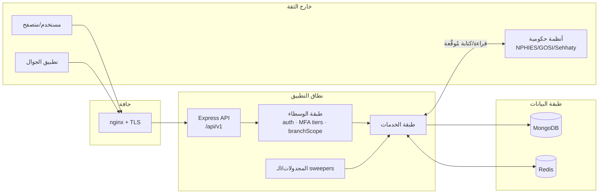

# نموذج التهديدات — Al-Awael ERP (STRIDE)

> **الحالة:** v1.0 · **التاريخ:** 2026-06-16 · **النطاق:** backend (Express/MongoDB)،
> التكاملات الحكومية السعودية (NPHIES/GOSI/SCFHS)، الواجهة (React)، الجوال (RN).
> يُغلق هذا الملف فجوة «نمذجة تهديدات موثّقة» المذكورة في
> [GAPS_ASSESSMENT_2026-06-15 §7](../GAPS_ASSESSMENT_2026-06-15.md).
>
> منهجية: STRIDE لكل حدّ ثقة، مع ربط كل تهديد بالضابط القائم فعلاً في الشيفرة
> (إن وُجد) أو تصنيفه فجوة متبقّية. هذا الملف **حيّ** — يُحدَّث مع كل موجة تمسّ
> الأمن.

---

## 1. الأصول الحرجة (Assets)

| الأصل                              | الحساسية     | الموقع                                                          |
| ---------------------------------- | ------------ | --------------------------------------------------------------- |
| بيانات المستفيدين الصحية (PHI/EMR) | حرِجة — PDPL | MongoDB `beneficiaries`, `assessments`, `sessions`, `careplans` |
| الهوية الوطنية / الإقامة           | حرِجة — PDPL | `Beneficiary.nationalId`, تكامل Sehhaty/Nafath                  |
| أسرار المصادقة (JWT/Encryption)    | حرِجة        | متغيرات البيئة، `config/validateEnv.js`                         |
| سلاسل تدقيق غير قابلة للتلاعب      | عالية        | `intelligence/hash-chain.lib.js`                                |
| رموز التكامل الحكومي (NPHIES/GOSI) | عالية        | متغيرات بيئة الخدمة                                             |
| بيانات الرواتب / WPS               | عالية        | `PayrollRun`, تكامل Mudad                                       |
| عزل بيانات الفروع (multi-tenant)   | عالية — PDPL | `branchFilter` / `assertBranchMatch`                            |

---

## 2. حدود الثقة (Trust Boundaries)

الحدود الأربعة الأهم:

1. **Untrusted → Edge** (المتصفح/الجوال → nginx/TLS): إنهاء TLS، rate-limit.
2. **Edge → App** (nginx → Express): مصادقة JWT + CSRF + CORS.
3. **App-internal** (route → service): تدرّج MFA + عزل الفروع + التفويض (SoD).
4. **App → Gov** (الخدمة → NPHIES/GOSI): توقيع/تحقق + قراءة-فقط في مسارات الحمل.

---

## 3. تحليل STRIDE

### S — انتحال الهوية (Spoofing)

| التهديد                                   | الضابط القائم                                                                          | المتبقّي                     |
| ----------------------------------------- | -------------------------------------------------------------------------------------- | ---------------------------- |
| سرقة/تزوير JWT                            | `JWT_SECRET ≥ 32` مفروض في الإنتاج عبر `config/validateEnv.js` (strict)؛ refresh منفصل | تدوير المفاتيح آلياً (Vault) |
| تجاوز MFA على عمليات حسّاسة               | حزمة 5 طبقات `requireMfaTier(N)` + `enforceMfa:true` + 3 حُرّاس انجراف (ADR-019)       | —                            |
| انتحال هوية وطنية في تكامل Nafath/Sehhaty | تحقّق التوقيع في `services/nafathSigningService.js`                                    | تغطية اختبار توقيع أوسع      |

### T — العبث بالبيانات (Tampering)

| التهديد                            | الضابط القائم                                                    | المتبقّي                         |
| ---------------------------------- | ---------------------------------------------------------------- | -------------------------------- |
| تعديل سجلّ سريري بأثر رجعي         | سلاسل hash-chain (`intelligence/hash-chain.lib.js`) + Versioning | —                                |
| Mass-assignment عبر `...req.body`  | منع الـ spread + transitions عبر نقاط مخصّصة (W506/W507)         | حارس CI شامل للـ mass-assignment |
| كتابة حقول غير مُعلَنة في السكيمَا | حارس ما-قبل-الدفع `check:phantom-writes` (W1217)                 | —                                |
| حقن NoSQL في الاستعلامات           | `express-mongo-sanitize` + Joi/validators                        | تدقيق دوري لمسارات `$where`      |

### R — الإنكار (Repudiation)

| التهديد                 | الضابط القائم                                          | المتبقّي                       |
| ----------------------- | ------------------------------------------------------ | ------------------------------ |
| إنكار إجراء سريري/إداري | Audit Trail + hash-chain غير قابل للتلاعب              | تصدير سجلّ تدقيق موقَّع زمنياً |
| تعديل سجلّات بلا أثر    | `loadMfaActor` + تسجيل المُنفِّذ على المسارات الحسّاسة | —                              |

### I — كشف المعلومات (Information Disclosure)

| التهديد                                              | الضابط القائم                                                                                                                     | المتبقّي                                                                    |
| ---------------------------------------------------- | --------------------------------------------------------------------------------------------------------------------------------- | --------------------------------------------------------------------------- |
| **IDOR عبر الفروع** (مستخدم فرع A يقرأ فرع B)        | `branchFilter` / `assertBranchMatch` / `effectiveBranchScope` (سلسلة W269، حارس `req.branchId`)                                   | إكمال تغطية المسارات المتبقّية (راجع CRITICAL_ISSUES §P0)                   |
| تسريب أسرار في git                                   | `gitleaks.yml` (W1303) + `.gitleaks.toml` + حارس `check:gitignored-sources`                                                       | —                                                                           |
| تسريب PII في السجلّات/الردود                         | مستويات حساسية + تنقية رسائل الخطأ                                                                                                | تدقيق دوري للـ log redaction                                                |
| احتفاظ مفرط بـ PII                                   | TTL ≥ 30 يوماً على مجموعات PII (PDPL)                                                                                             | تطبيق TTL على المجموعات المتبقّية                                           |
| **Stored XSS عبر رفع SVG** (ملف يُخدَم من نفس الأصل) | `validateUploadedFile` (فحص magic-bytes + `BLOCKED_MIMES` يحظر `image/svg+xml`) مُطبَّق على `medicalFiles.js` + `media.routes.js` | **فجوة #6**: `routes/uploads.routes.js` لا يستدعيه ويسمح بـ `image/svg+xml` |

### D — حجب الخدمة (Denial of Service)

| التهديد                          | الضابط القائم                                             | المتبقّي                   |
| -------------------------------- | --------------------------------------------------------- | -------------------------- |
| إغراق الـ API                    | rate-limit على الحافة + لكل مسار                          | ضبط حدود لكل tenant        |
| استعلامات ثقيلة غير مفهرسة       | فهارس Mongoose + اختبارات حمل k6 (W1304/W1350) بعتبات SLO | ربط k6 بخط CI/staging فعلي |
| قصف بيئات NPHIES/GOSI الاختبارية | ملف الحمل الحكومي **قراءة-فقط** مفروض بحارس `wave1350`    | —                          |

### E — رفع الامتياز (Elevation of Privilege)

| التهديد                                | الضابط القائم                                          | المتبقّي                         |
| -------------------------------------- | ------------------------------------------------------ | -------------------------------- |
| تجاوز RBAC                             | كتالوج أدوار + جدول صلاحيات (ADR-005) + `requireRole`  | —                                |
| تجاوز فصل الواجبات (SoD)               | `intelligence/sod.lib.js` على نقاط الاعتماد            | توسيع تغطية SoD للمسارات الجديدة |
| تشغيل عملية بصلاحيات أعلى عبر cron/CLI | `enforceMfa:true` كدفاع-في-العمق على المُجدولات (W275) | —                                |

---

## 4. الفجوات المتبقّية ذات الأولوية (Residual Risks)

| #   | الفجوة                                                                                                                                                                                                                                                                                                                                                                                                                 | الأولوية | المُلكية/الحاجز                                              |
| --- | ---------------------------------------------------------------------------------------------------------------------------------------------------------------------------------------------------------------------------------------------------------------------------------------------------------------------------------------------------------------------------------------------------------------------- | -------- | ------------------------------------------------------------ |
| 1   | لا إدارة أسرار مركزية (Vault) — الأسرار في `.env`                                                                                                                                                                                                                                                                                                                                                                      | عالية    | قرار بنية تحتية                                              |
| 2   | لا DAST في CI (SAST موجود: CodeQL + gitleaks)                                                                                                                                                                                                                                                                                                                                                                          | متوسطة   | بيئة هدف                                                     |
| 3   | `backend/.env.example` ناقص 3 مفاتيح حرجة يفرضها المخطّط الصارم: `JWT_REFRESH_SECRET` · `ENCRYPTION_KEY` · `SESSION_SECRET` — النشر من القالب يفشل عند `CI=true`/الإنتاج                                                                                                                                                                                                                                               | متوسطة   | الملف يُعدَّل حالياً بجلسة موازية؛ إصلاح من سطرين فور تحرّره |
| 4   | إكمال عزل الفروع للمسارات المتبقّية                                                                                                                                                                                                                                                                                                                                                                                    | عالية    | عمل مستمر (W269 series)                                      |
| 5   | ربط اختبارات الحمل (k6) بخط أنابيب staging فعلي                                                                                                                                                                                                                                                                                                                                                                        | متوسطة   | بيئة هدف + رمز خدمة                                          |
| 6   | **Stored XSS عبر رفع SVG**: `routes/uploads.routes.js` يسمح بـ `image/svg+xml` في `ALLOWED_MIMES`، ولا يستدعي `validateUploadedFile`، ويُخدَم علناً عبر nginx ثابتاً (`/uploads/*`) بلا ضابط disposition — SVG قد يحمل `<script>` يُنفَّذ في أصل التطبيق. (الشقيقان `documents.routes.js` + `files.routes.js` يسمحان بـ svg/html أيضاً لكنهما محميّان على جانب الخدمة بـ W462/W463 — فالمكشوف فعلاً هو `uploads` وحده) | عالية    | قرار منتج (إسقاط svg) أو بنية تحتية (ترويسة nginx) ⇒ مؤجَّلة |

> **الفجوة #6 (W1355 → W1356 تنقيح دقّة):** المسارَان الشقيقان
> `medicalFiles.js` + `media.routes.js` يطبّقان `validateUploadedFile` (الذي
> يحظر `image/svg+xml` ضمن `BLOCKED_MIMES` ويتحقّق من magic-bytes). والمساران
> `documents.routes.js` + `files.routes.js` — وإن سمحا بـ svg/html في قائمة
> الرفع — **محميّان فعلاً على جانب الخدمة** بضابط disposition (W462/W463): عند
> المعاينة/التنزيل يفرضان `Content-Disposition: attachment` + `X-Frame-Options:
DENY` + `Content-Security-Policy: sandbox` للأنواع التنفيذية، فلا تُعرَض
> inline في أصل التطبيق. أمّا `routes/uploads.routes.js` فهو **المسار الوحيد
> المكشوف فعلاً**: يُخدَم علناً عبر nginx ثابتاً (لا يمرّ بـ Node فلا ضابط
> disposition)، ويسمح بـ SVG، ولا يستدعي `validateUploadedFile`. المعالجة
> المتّسقة مع النمط القائم — أيّ من: (أ) استدعاء `validateUploadedFile` بعد
> `upload.single('file')` + إسقاط `image/svg+xml` من `ALLOWED_MIMES` (يطابق
> الشقيقَين، لكن يغيّر سلوكاً مدفوعاً ⇒ قرار منتج)؛ (ب) دفاع-في-العمق على جانب
> الخدمة: ترويسة `Content-Disposition: attachment` + `X-Content-Type-Options:
nosniff` على `/uploads/*` في nginx (تغيير بنية تحتية، لا يرفض أي رفع). كلاهما
> مؤجَّل لمالكه. حارس `__tests__/upload-svg-xss-guard-wave1355.test.js` يرصد
> غياب مُتحقِّق جانب-الرفع (إشارة دفاع-في-العمق) ويمنع انتشار الصنف.

> الفجوة #3 مُتحقَّق منها هذه الموجة: المخطّط الصارم في `config/validateEnv.js`
> (`strictOverrides`) يتطلّب 5 مفاتيح، بينما `backend/.env.example` يوثّق
> `MONGODB_URI` + `JWT_SECRET` فقط كقيم قابلة للإسناد. عند تحرّر الملف من
> الجلسة الموازية: أضِف الثلاثة مع تلميحات التوليد (`openssl rand -base64 64`)
> ثم احرسها بتأكيد يطابق مفاتيح `strictOverrides` مقابل `.env.example`.
>
> **W1354:** أُضيف preflight تنفيذي `npm run env:check`
> (`backend/scripts/check-env.js`) يسرد في تمريرة واحدة كل مفتاح حرج ناقص/فارغ
> مع تلميح توليده ويخرج بـ exit 1 — بدل انهيار الإقلاع على أول مفتاح. قائمة
> المفاتيح المطلوبة مُصدَّرة من `config/validateEnv.js` (`STRICT_REQUIRED_KEYS`،
> مُشتقّة من مخطّط Joi الصارم) فلا تنجرف أبداً عمّا يفرضه مُتحقِّق الإقلاع. حارس
> ذاتي `__tests__/check-env-script.test.js` (4 تأكيدات، sprint).

---

## 5. مراجع الضوابط

- تدرّج MFA: `docs/architecture/decisions/019-*` + حزمة الحُرّاس الخمسة.
- عزل الفروع: `backend/middleware/assertBranchMatch.js` + سلسلة W269.
- سلاسل التدقيق: `backend/intelligence/hash-chain.lib.js`.
- التحقّق من البيئة: `backend/config/validateEnv.js`.
- فحص الأسرار: `.github/workflows/gitleaks.yml` (W1303).
- اختبارات الحمل: `backend/tests/load/k6-load.js` + `k6-gov-integrations.js`.
